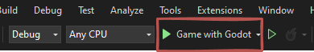
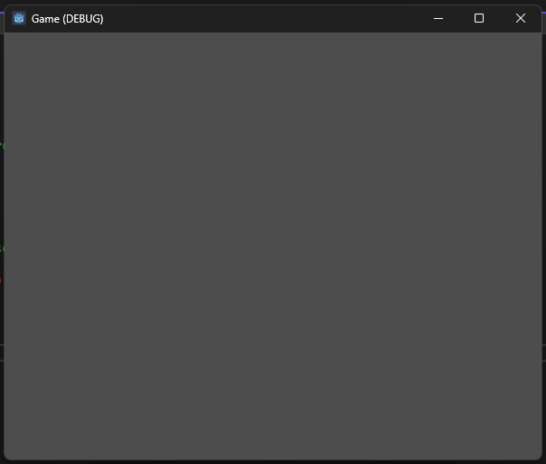

# Erste Schritte

## Download von Godot

Um mit der Spieleentwicklung zu beginnen, benötigen wir die Godot Engine. Die Spieleengine kann unter folgendem Link heruntergeladen werden: [Godot Engine - Download für Windows](https://godotengine.org/download/windows/). 

!!! warning 
    Stellen Sie sicher, dass Sie die **Godot Engine - .NET** Version herunterladen, da wir C# für die Entwicklung verwenden werden.

### Schritte zum Herunterladen und Speichern:

1. Besuchen Sie die [Godot Download-Seite für Windows](https://godotengine.org/download/windows/).
1. Laden Sie die **Godot Engine - .NET** Version herunter.
1. Entpacken Sie die heruntergeladenen Dateien auf Ihrem System.

Das Programm muss nicht installiert werden. Den heruntergeladenen Ordner können Sie an einem beliebigen Ort auf Ihrem System speichern, damit Sie später darauf zugreifen können.

!!! info
    Es ist ratsam, den Speicherort des Ordners nicht zu ändern, nachdem Sie ihn festgelegt haben, um Probleme beim Pfadzugriff zu vermeiden.

## Einrichtung des Projekts

Wir erstellen das gesamte Spiel in einem C#-Projekt, ohne die Verwendung der Godot-IDE. Hierfür gibt es ein bereits vorgefertigtes Projekt. Beziehen Sie dieses von der Dateiablage.

### Debugging aktivieren

Um die Möglichkeit zum Debugging zu aktivieren, gehen wir wie folgt vor:

1. Unter dem Reiter **"Debug"** wählen wir den letzten Punkt **"Debug Properties"**.
2. Danach fügen wir durch Klick auf den Reiter oben Links ein neues Profil hinzu. Dort wählen wir **"Executable"** aus und stellen sicher, dass dieses Profil ausgewählt ist.
3. Danach fügen wir unter **"Path to the executable to run."** den Pfad zu Godot ein.
4. Im Anschluss definieren wir unter **"Command line arguments"** die Argumente `--path . --verbose`. 
    - `--path .` legt fest, dass der Pfad zum Projekt der aktuelle ist (`.`).
    - Durch das Argument `--verbose` werden alle möglichen Fehler zur Laufzeit des Programms ausgegeben.
5. Unter **"Working directory"** tragen wir einen Punkt `.` ein. Damit sagen wir der Anwendung, dass das Arbeitsverzeichnis auch das aktuelle ist.

Alle anderen Einstellungen bleiben leer, es wird auch sonst nichts angehakt.

Hier ein Beispiel, wie die Einstellungen aussehen sollten:

!!! warning 
    Achten Sie darauf, den korrekten Pfad zur Godot-Executable anzugeben, um Fehler beim Starten des Debuggings zu vermeiden.

Nachdem diese Einstellungen vorgenommen wurden, ist das Projekt bereit für das Debugging, und wir können mit der Implementierung der Spielelogik fortfahren.

Starten Sie nun die Anwendung mit dem eben erstellten Profil:

Wurden die Einstellungen richtig vorgenommen, sollte das Programm nun starten und Sie sollten ein leeres Fenster sehen.

