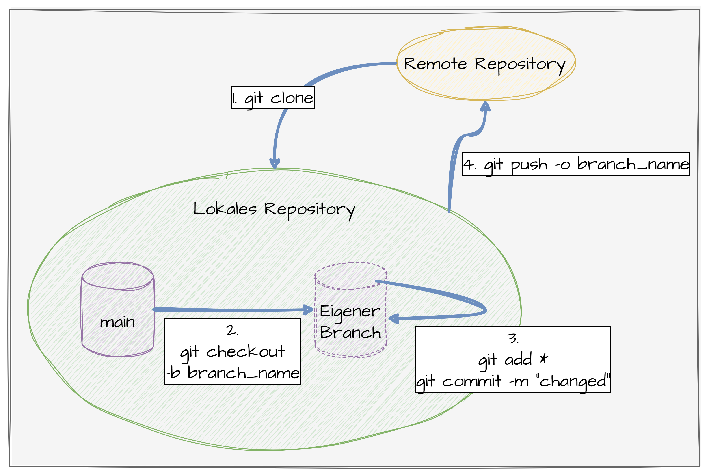

# Git in Kommandozeile Kurzübersicht



## 1. Repository von Remote kopieren:

```
git clone https://bszw-git.ddns.net:3000/swopperer/Zufallsgenerator.git
```

## 2. Neuen Branch erstellen und auschecken:

```
git checkout -b bfi11a_max_mustermann
```

## 3. Coden und Änderungen commiten:

```
git add *
git commit -m "Neue Klasse Person erstellt"
```

!!! info
    Commite lieber öfter als zu wenig!

## 4. Code in eigenen Branch pushen:

```
git push -o bfi11a_max_mustermann
```
