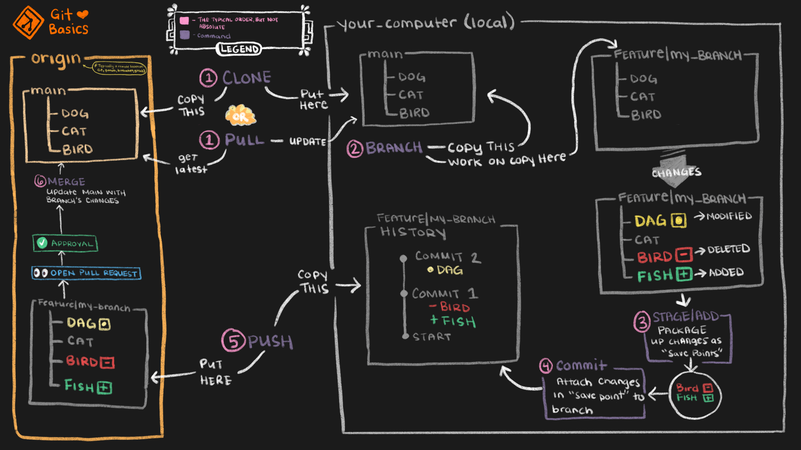

# Git in Visual Studio

<figure markdown="span">
  
  <figcaption>Quelle: https://www.getdbt.com/ui/img/guides/analytics-engineering/git-workflow-1.png</figcaption>
</figure>

## 1. Repository von Remote kopieren:

Visual Studio starten und "Clone a repository" wählen

{ width="600" }

URL des Remote Repos kopieren:

{ width="800" }

Danach Remote Repository URL und Pfad zum Speichern auf lokalem Gerät angeben:

{ width="600" }

## Übersicht

Über `View --> Git Repository` oder `Crtl+0, Ctrl+R` kann die Git Übersicht von Visual Studio geöffnet werden.

{ width="500" }

In diesem Fenser finden Sie alle Branches (grün schraffiert) und die Historie (gelb schraffiert):

## 2. Neuen Branch erstellen und auschecken:

Im Menübereich unter `Git` im Unterpunkt `New Branch...` kann ein neuer Branch angelegt werden:

{ width="500" }

Namen für den Branch vergeben (klasse_vorname_nachname) und von welchem Branch es weg kopiert werden soll:

{ width="500" }

Dieser wird dann in der Übersicht angezeigt:

## 3. Coden und Änderungen commiten:

Änderungen werden im `Solution Explorer` durch einen kleinen roten Haken angezeigt (hier ist in Program.cs eine Änderung enthalten):

{ width="400" }

Eine Übersicht über die Änderungen kann unter `Git Changes` im gleichen Abschnitt des Solution Explorers angezeigt werden:

{ width="300" }

Mit Doppelklick auf die angezeigt Datei werden die Änderung in der Datei angezeigt. Links das Original, rechts mit Änderungen, grün markiert.

Unter `Git Changes` kann eine Commit-Message eingegeben werden. Commit All fügt die angezeigten Änderungen automatisch zur Staging-Area hinzu und commitet im Anschluss automatisch mit der eingegebenen Commit-Message.

Die Änderung wird nach dem Commit auch in der Übersicht dargestellt:

## 4. Code in eigenen Branch pushen:

Um die Änderungen jetzt im Remote Repository hochzuladen, muss der Branch mit den Änderungen noch gepusht werden:

{ width="500" }

Nun wird der Branch auch in der Übersicht unter `remotes` angezeigt:

{ width="500" }