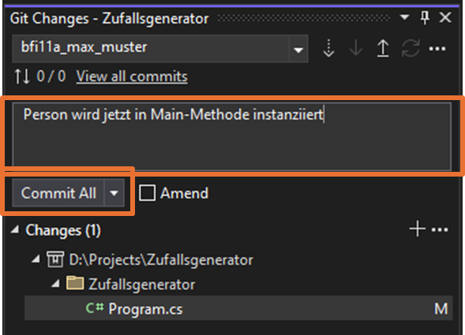

# Git in Visual Studio Kurzübersicht

## 1. Repository von Remote kopieren:

Visual Studio starten und "Clone a repository" wählen

{ width="600" }

URL des Remote Repos kopieren:

{ width="800" }

Danach Remote Repository URL und Pfad zum Speichern auf lokalem Gerät angeben:

{ width="600" }

## 2. Neuen Branch erstellen und auschecken:

Im Menübereich unter `Git` im Unterpunkt `New Branch...` kann ein neuer Branch angelegt werden:

{ width="500" }

Namen für den Branch vergeben (klasse_vorname_nachname) und von welchem Branch es weg kopiert werden soll:

{ width="500" }

## 3. Coden und Änderungen commiten:

Unter `Git Changes` Commit-Message eingegeben. Commit All fügt die angezeigten Änderungen automatisch zur Staging-Area hinzu und commitet im Anschluss automatisch mit der eingegebenen Commit-Message.

{ width="500" }

## 4. Code in eigenen Branch pushen:

Um die Änderungen jetzt im Remote Repository hochzuladen, muss der Branch mit den Änderungen noch gepusht werden:

{ width="500" }