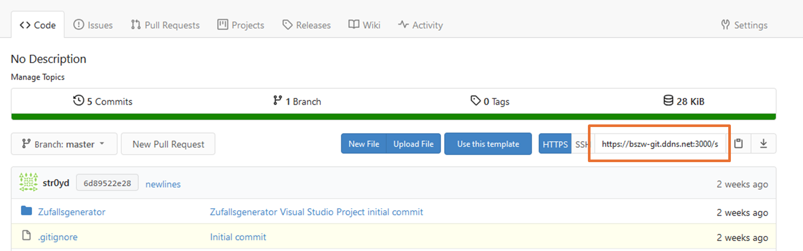

# Git


##Schritt 1 - Klone das Original-Repository

Bevor du mit der lokalen Entwicklung beginnen kannst, solltest du eine Kopie des Repositories klonen, an dem du arbeitest.

In der Befehlszeile verwendest du den Befehl `git clone`.

Beispiel:

Remote Repository URL kopieren:



In Kommandozeile:

```
git clone https://bszw-git.ddns.net:3000/swopperer/Zufallsgenerator.git
```

##Schritt 2 - Erstelle deinen Entwicklungs-Branch

Anstatt auf dem Haupt-Produktions-Branch zu arbeiten, solltest du einen eigenen sicheren Bereich für deine Entwicklungsarbeit erstellen.

Nichts, was du hier tust, ist in Stein gemeißelt, also experimentiere so viel du möchtest mit dem Code.

In der Befehlszeile würdest du den Befehl git branch verwenden, um deinen lokalen Klon des Repositories auf einen neuen Branch zu verschieben. 

##Schritt 3 - Stufe deine Änderungen an den Dateien

Wenn du Änderungen an den Dateien vorgenommen hast, die du auf deinem Branch festhalten möchtest, musst du sie zuerst stagen, was sie als logischen Speicherpunkt zusammenfasst.

In der Befehlszeile würdest du dies mit dem Befehl git stage tun. Dein Branch bleibt unverändert, bis du die Änderungen stagst und dann im nächsten Schritt committest. 

##Schritt 4 - Committe deine gestagten Änderungen im lokalen Repository

Sobald du mit deinen gestagten Änderungen zufrieden bist, ist es an der Zeit, sie in deinem Branch zu committen.

In der Befehlszeile würdest du dies mit dem Befehl git commit durchführen.

Um diesen Commit für den Rest deines Teams sichtbar zu machen, musst du ihn im nächsten Schritt in das Remote-Repository pushen. 

##Schritt 5 - Pushe deine Änderungen ins Remote-Repository und öffne eine Pull-Request

Durch das Pushen deiner Commits können alle anderen im Team deine Codeänderungen herunterladen und testen.

In der Befehlszeile würdest du dies mit dem Befehl git push tun.

Wenn du bereit bist, deine Änderungen in die Produktion zu übernehmen, kannst du nun eine Pull-Request öffnen, um deinen Code von jemand anderem im Team überprüfen zu lassen.

Wenn du ohne Merging zusammenarbeiten möchtest, pushe einfach deinen Branch ins Remote-Repository und bitte deinen Kollegen, einen Pull durchzuführen, um eine Kopie deines Branches zu erhalten.