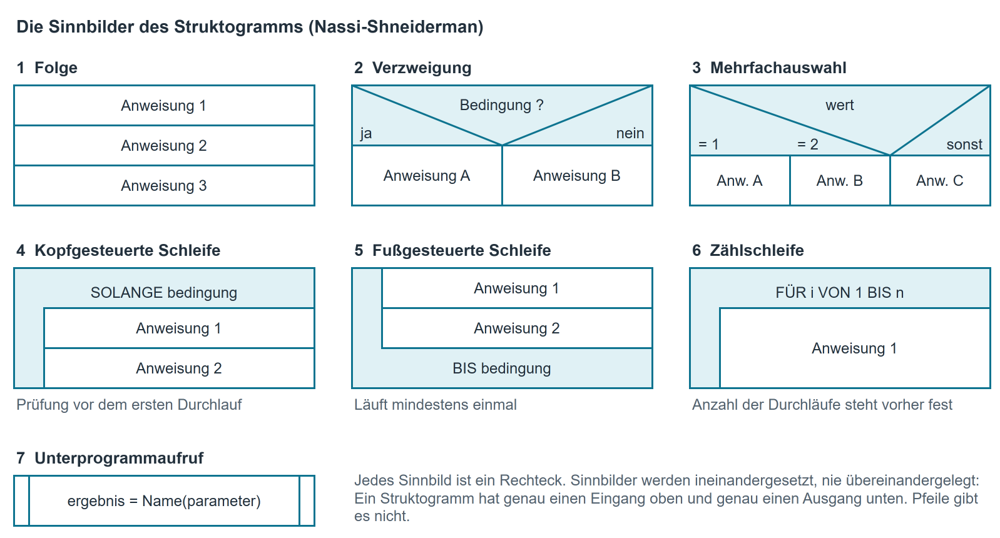
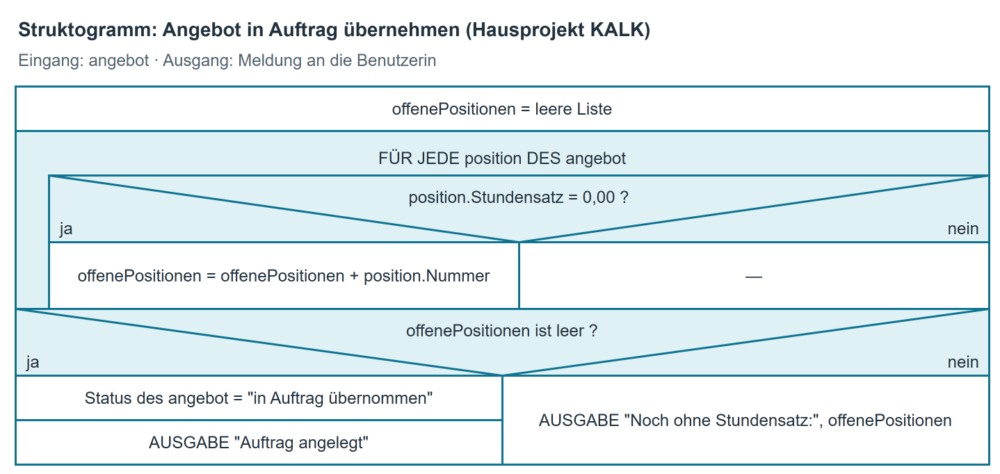

# Pseudocode und Struktogramm

Diese Seite behandelt zwei Schreibweisen für denselben Gegenstand: **Pseudocode**
([Was Pseudocode ist](#was-pseudocode-ist) bis [Beispiel aus dem Hausprojekt KALK](#beispiel-aus-dem-hausprojekt-kalk))
und das **Struktogramm** ([Was ein Struktogramm ist](#was-ein-struktogramm-ist) bis
[Dasselbe Beispiel als Struktogramm](#dasselbe-beispiel-als-struktogramm)). Die Umsetzung zwischen
ihnen steht in [Umsetzung Pseudocode ↔ Struktogramm](#umsetzung-pseudocode-struktogramm), die Wahl
der Notation in [Wann welche Notation](#wann-welche-notation).

## Was Pseudocode ist { #was-pseudocode-ist }

Pseudocode beschreibt einen Ablauf in kurzen, festgelegten Wortbausteinen. Er sieht aus wie ein
Programm, ist aber keines: Er lässt sich nicht übersetzen und nicht starten. Dafür kann ihn jede
Person lesen, die Deutsch versteht, und jede Entwicklerin kann ihn in ihre Programmiersprache
übertragen.

In der Methodenabteilung wird Pseudocode überall dort benutzt, wo ein Ablauf festgehalten werden
muss, bevor jemand programmiert: in Pflichtenheften, in Prüfprotokollen, in Rückfragen an
Auftraggeber.

### Wann Pseudocode, wann eine Zeichnung?

| Situation | Besser geeignet |
|-------------------------------------------------------------|------------------------------|
| Der Ablauf hat viele Verzweigungen, die man auf einen Blick sehen soll | [Aktivitätsdiagramm](../uml/aktivitaetsdiagramm.md) |
| Der Ablauf soll später Zeile für Zeile in Code übersetzt werden | Pseudocode |
| Der Ablauf steht in einer E-Mail oder in einem Fließtext | Pseudocode |
| Jemand ohne IT-Hintergrund soll den Ablauf bestätigen | [Aktivitätsdiagramm](../uml/aktivitaetsdiagramm.md) |
| Die Blockstruktur soll unübersehbar sein (was gehört zur Schleife?) | [Struktogramm](#was-ein-struktogramm-ist) |
| Der Ablauf wird in der IHK-Prüfung abgefragt | beides; die Aufgabe sagt, welches |

Ausführlich steht der Vergleich in [Wann welche Notation](#wann-welche-notation).

## Vorgehen

1. Grenzen bestimmen: Womit beginnt der Ablauf, womit endet er, was kommt hinein, was kommt heraus?
2. Werte benennen, die sich während des Ablaufs ändern, und ihren Startwert festlegen.
3. Den Ablauf in der Reihenfolge aufschreiben, in der er passiert; jede Ebene um zwei Leerzeichen einrücken.
4. Jede Entscheidung so formulieren, dass sie nur wahr oder falsch sein kann. Grenzwerte ausschreiben: „mehr als 1.000,00 €" ist etwas anderes als „mindestens 1.000,00 €".
5. Am Ende prüfen: Kommt jeder Wert, der gelesen wird, vorher irgendwo vor? Wird jede Schleife auch wieder verlassen?

## Schreibweise nach dem IHK-Belegsatz

Die Prüfungen der IHK verwenden eine feste Schreibweise. Schlüsselwörter stehen in
Großbuchstaben, jeder Block wird mit `ENDE …` geschlossen.

| Baustein | Schreibweise |
|--------------------------|--------------------------------------------------------|
| Zuweisung | `wert = ausdruck` |
| Eingabe / Ausgabe | `EINGABE wert` , `AUSGABE text` |
| Bedingung | `WENN bedingung DANN … SONST … ENDE WENN` |
| Kopfgesteuerte Schleife | `SOLANGE bedingung … ENDE SOLANGE` |
| Fußgesteuerte Schleife | `WIEDERHOLE … BIS bedingung` |
| Zählschleife | `FÜR i VON 1 BIS n … ENDE FÜR` |
| Unterprogramm | `FUNKTION name(parameter) … RÜCKGABE wert … ENDE FUNKTION` |
| Aufruf | `ergebnis = name(parameter)` |
| Runden | `wert = wert auf Cent gerundet` (eigener Schritt, in Worten) |
| Vergleich | `=  <>  <  <=  >  >=` |
| Verknüpfung | `UND` , `ODER` , `NICHT` |
| Wahrheitswerte | `WAHR` , `FALSCH` |
| Kommentar | `// Text` |

## Beispiel aus dem Hausprojekt KALK { #beispiel-aus-dem-hausprojekt-kalk }

Das Werkzeug KALK kennt den Menüpunkt „Angebot in Auftrag übernehmen". Ein Angebot darf erst
übernommen werden, wenn jede seiner Positionen einen Stundensatz hat. Fehlt bei einer Position
der Satz, bekommt die Person eine Liste der offenen Positionen.

```
FUNKTION AngebotInAuftragUebernehmen(angebot)
  offenePositionen = leere Liste

  FÜR JEDE position DES angebot
    WENN position.Stundensatz = 0,00 DANN
      offenePositionen = offenePositionen + position.Nummer
    ENDE WENN
  ENDE FÜR

  WENN offenePositionen ist leer DANN
    Status des angebot = "in Auftrag übernommen"
    AUSGABE "Auftrag angelegt"
  SONST
    AUSGABE "Noch ohne Stundensatz:", offenePositionen
  ENDE WENN
ENDE FUNKTION
```

Zwei Stellen sind hier wichtig. Erstens die Schleife: Sie läuft über die **Positionen des
Angebots**, nicht über die Leistungsarten der Preisliste – sonst würde eine Position, die gar
keinen Satz bekommen hat, nie auffallen. Zweitens die Abfrage `offenePositionen ist leer`: Sie
entscheidet, welcher der beiden Wege genommen wird, und beide Wege enden mit einer Ausgabe. Ein
Ablauf, bei dem ein Weg stillschweigend nichts tut, ist für den, der ihn später programmiert, eine
Einladung zum Raten.

## Was ein Struktogramm ist { #was-ein-struktogramm-ist }

Ein Struktogramm — nach seinen Erfindern auch **Nassi-Shneiderman-Diagramm** genannt — stellt
denselben Ablauf als Rechteck dar, das von oben nach unten gelesen wird. Jeder Schritt ist ein
Kasten; Schritte, die zusammengehören, stecken ineinander. Drei Eigenschaften machen es aus:

- **Genau ein Eingang oben, genau ein Ausgang unten.** Man kann nirgends hineinspringen.
- **Keine Pfeile.** Die Reihenfolge ergibt sich aus der Lage der Kästen. Wer Pfeile zeichnet,
  zeichnet einen Programmablaufplan (PAP).
- **Verschachtelung statt Verweis.** Was zu einer Schleife gehört, liegt sichtbar in ihr drin —
  beim Pseudocode muss man dafür die Einrückung lesen. Der Preis: Ein Struktogramm wird breit,
  sobald es tief verschachtelt ist, und passt in keine E-Mail.

## Die Sinnbilder

{ .diagramm }

Der Unterschied zwischen kopf- und fußgesteuerter Schleife ist prüfungsrelevant: Die
**kopfgesteuerte** Schleife kann auch **keinmal** durchlaufen werden, weil zuerst geprüft wird.
Die **fußgesteuerte** läuft **mindestens einmal**, weil erst am Ende geprüft wird. An der Lage
des Bedingungsstreifens sieht man das sofort.

## Vorgehen beim Zeichnen

1. Ein Rechteck über die volle Breite anlegen; das ist der ganze Ablauf. Von oben nach unten die Schritte eintragen, jeder als Kasten über die volle Breite.
2. Entscheidung: Kasten mit zwei Diagonalen teilen, darunter zwei Spalten — links der Ja-Weg, rechts der Nein-Weg. Ein leerer Weg bekommt einen leeren Kasten, er wird nicht weggelassen.
3. Wiederholung: Bedingungsstreifen anlegen (oben oder unten) und den Rumpf eingerückt hineinsetzen.
4. Zum Schluss prüfen: Ist das Ganze immer noch ein geschlossenes Rechteck? Überlappt kein Kasten?

## Dasselbe Beispiel als Struktogramm { #dasselbe-beispiel-als-struktogramm }

Derselbe Ablauf wie im [Beispiel aus dem Hausprojekt KALK](#beispiel-aus-dem-hausprojekt-kalk) — „Angebot in Auftrag übernehmen“ —, nur anders aufgeschrieben:

{ .diagramm }

Der Ja-Weg der inneren Verzweigung sammelt die Positionsnummer ein, der Nein-Weg tut nichts — und
trotzdem steht dort ein Kasten. Das ist kein Schönheitsfehler: Ein leerer Weg, den man sehen kann,
ist eine Entscheidung; ein weggelassener Weg ist eine Lücke.

## Umsetzung Pseudocode ↔ Struktogramm { #umsetzung-pseudocode-struktogramm }

Beide Notationen kennen dieselben Bausteine. Man geht den Ablauf einmal von oben nach unten durch
und ersetzt Baustein für Baustein.

| Pseudocode | Struktogramm |
|--------------------------------------|----------------------------------------------------|
| Zuweisung, Ein- oder Ausgabe | ein Kasten über die volle Breite |
| `WENN … DANN … SONST … ENDE WENN` | Verzweigungskopf, darunter zwei Spalten |
| `WENN … DANN … ENDE WENN` (ohne `SONST`) | Verzweigungskopf, rechte Spalte bleibt leer |
| `SOLANGE … ENDE SOLANGE` | Bedingungsstreifen oben, Rumpf eingerückt |
| `WIEDERHOLE … BIS …` | Rumpf oben, Bedingungsstreifen unten |
| `FÜR … ENDE FÜR` | Zählschleifenkopf, Rumpf eingerückt |
| `ergebnis = name(parameter)` | Kasten mit zwei senkrechten Innenlinien |
| Einrückung um zwei Leerzeichen | Kasten liegt sichtbar innerhalb des äußeren Kastens |

Zwei Punkte gehen dabei erfahrungsgemäß verloren. **Der leere Weg:** Ein leerer Kasten wird zu
einem `WENN` *ohne* `SONST`, nicht zu einem `SONST` ohne Inhalt. **Die Schleifenart:** Wer einen
unten liegenden Bedingungsstreifen zu `SOLANGE` macht, ändert den Ablauf — aus „mindestens
einmal“ wird „vielleicht keinmal“.

Aus einem **[Aktivitätsdiagramm](../uml/aktivitaetsdiagramm.md)** übersetzt man ebenso. Dort muss man die Wiederholung
zuerst erkennen: Eine Entscheidung, von der eine Kante zu einer früheren Zusammenführung
zurückläuft, ist eine Schleife und wird zu `SOLANGE` oder `FÜR JEDE`.

## Wann welche Notation { #wann-welche-notation }

| | Pseudocode | Struktogramm | [Aktivitätsdiagramm](../uml/aktivitaetsdiagramm.md) |
|---|---|---|---|
| Stärke | Zeile für Zeile in Code übertragbar; passt in Fließtext und E-Mail | zeigt die Blockstruktur unverkennbar | zeigt Wege und Beteiligte als Bild |
| Schwäche | Blöcke nur an der Einrückung erkennbar | wird bei tiefer Verschachtelung sehr breit; nur auf Papier | Schleifen sind mühsam zu lesen |
| Am besten für | die Übergabe an die Entwicklung | eine strittige Blockstruktur | die Bestätigung durch den Fachbereich |

Faustregel der Abteilung: **Ein Ablauf, eine Person, später Code — Pseudocode. Ein Ablauf,
mehrere Beteiligte, zur Abstimmung — [Aktivitätsdiagramm](../uml/aktivitaetsdiagramm.md). Ein Ablauf, dessen Blockstruktur
strittig ist — Struktogramm.**

## Kurzreferenz

| Prüfen Sie zum Schluss | Frage |
|--------------------|-------------------------------------------------------------|
| Blöcke | Hat jedes `WENN` ein `ENDE WENN`, jede Schleife ein `ENDE`? |
| Startwerte | Hat jeder Wert, der erhöht wird, vorher einen Startwert? |
| Grenzen | Steht überall der richtige Operator: `>` oder `>=`, `<` oder `<=`? |
| Schleifenende | Wird die Schleife unter allen Umständen verlassen? |
| Rückgabe | Gibt jeder Weg durch die Funktion etwas zurück? |
| Sprache | Steht dort ein Fachbegriff aus C#? Dann ersetzen. |
| Struktogramm: Rahmen | Ist das Ganze ein geschlossenes Rechteck, ohne Pfeile und ohne Überlappung? |
| Struktogramm: Wege | Hat jede Verzweigung beide Wege, auch den leeren? |
| Struktogramm: Schleifenart | Liegt der Bedingungsstreifen oben (kann keinmal laufen) oder unten (läuft mindestens einmal)? |
| Beide | Beschreiben Pseudocode und Zeichnung wirklich denselben Ablauf? |

**Typische Fehler beim Pseudocode:** `ENDE`-Zeile vergessen; Einrückung passt nicht zu den
Blöcken; „mindestens" mit `>` statt `>=` übersetzt; Zähler wird in der Schleife nicht erhöht.

**Typische Fehler beim Struktogramm:** Pfeile zwischen den Kästen; der Rumpf einer Schleife ist so
breit wie die Schleife selbst, sodass man nicht sieht, was dazugehört; der leere Weg einer
Verzweigung fehlt; eine fußgesteuerte Schleife wird mit dem Bedingungsstreifen oben gezeichnet;
das Blatt reicht nicht, und der Rest wird daneben weitergezeichnet.
