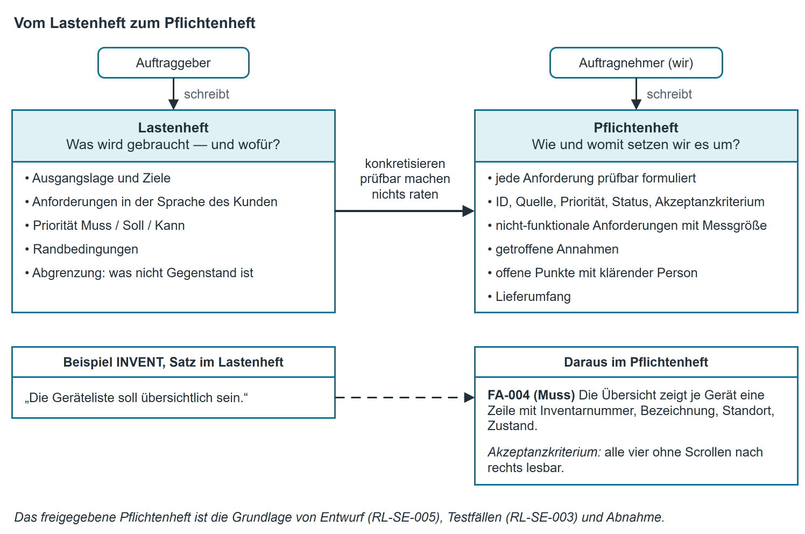

# Anforderungen — Lastenheft und Pflichtenheft

## Was eine Anforderung ist

Eine **Anforderung** ist eine einzelne, überprüfbare Aussage darüber, was ein System können oder
welche Eigenschaft es haben muss. Sie ist die Grundlage für alles, was danach kommt: Der Entwurf
wird auf sie zurückgeführt (RL-SE-005, 3.1), die Testfälle werden aus ihr abgeleitet, und die
Abnahme misst an ihr. Was nicht in den Anforderungen steht, wird nicht gebaut und nicht bezahlt.

Zwei Dokumente teilen sich die Aufgabe. Sie unterscheiden sich nicht im Thema, sondern in der
Frage, die sie beantworten, und in der Person, die sie schreibt.

| | **Lastenheft** | **Pflichtenheft** |
|---|---|---|
| Schreibt | der **Auftraggeber** (Kunde, interner Besteller) | der **Auftragnehmer** (wir) |
| Beantwortet | **Was** wird gebraucht und **wofür**? | **Wie** und **womit** setzen wir das um? |
| Sprache | Fachsprache des Kunden, lösungsneutral | unsere Fachsprache, mit technischen Festlegungen |
| Verbindlichkeit | Grundlage der Anfrage und des Angebots | Grundlage des Vertrags und der Abnahme |
| Enthält typisch | Ausgangslage, Ziele, Anforderungen mit Priorität, Randbedingungen, Abgrenzung | dieselben Anforderungen konkretisiert, Annahmen, offene Punkte, Abnahmekriterien, Lieferumfang |
| Norm | DIN 69901-5 | DIN 69901-5 |

!!! tip "Merksatz"
    Das Lastenheft ist die Frage, das Pflichtenheft die Antwort. Wer das Pflichtenheft
    schreibt, schreibt nicht ab: Er nimmt jede Anforderung des Kunden auf, macht sie prüfbar,
    ergänzt, was der Kunde nicht wissen konnte, und schreibt auf, was er dabei angenommen hat.

## Funktionale und nicht-funktionale Anforderungen

| Art | Frage | Beispiele | Kennung |
|---|---|---|---|
| **Funktional** | Was tut das System? | Daten aufnehmen, prüfen, berechnen, ausgeben, eine Regel durchsetzen | FA-nnn |
| **Nicht-funktional** | Wie gut, wie sicher, wie schnell, wie bedienbar? | Antwortzeit, Bedienbarkeit ohne Schulung, Wartbarkeit, Datenschutz, Betriebsumgebung | NFA-nnn |

Nicht-funktionale Anforderungen werden nach den Qualitätsmerkmalen der **ISO/IEC 25010**
geordnet: Funktionalität, Zuverlässigkeit, Effizienz, Benutzbarkeit, Sicherheit, Wartbarkeit,
Übertragbarkeit, Kompatibilität. Sie sind der häufigste Ort für unprüfbare Sätze — deshalb gilt:
**Eine nicht-funktionale Anforderung ohne Messgröße ist keine Anforderung, sondern ein Wunsch.**

Nicht zu verwechseln sind Anforderungen mit **Randbedingungen** (was vorgegeben ist und nicht
verhandelt wird: vorhandene Rechner, kein Server, kein Budget für Lizenzen) und mit der
**Abgrenzung** (was ausdrücklich nicht Gegenstand des Auftrags ist). Beides gehört ins Dokument,
zählt aber nicht als Anforderung.

## Attribute je Anforderung und Priorisierung { #attribute-je-anforderung-und-priorisierung }

Nach RL-SE-001, Kapitel 7.3 trägt jede Anforderung dieselben Angaben:

| Feld | Inhalt |
|---|---|
| **ID** | eindeutig und unveränderlich, z. B. FA-004, NFA-002 |
| **Titel** | knapper Name, höchstens 80 Zeichen |
| **Beschreibung** | die Anforderung selbst, ein Satz je Anforderung |
| **Quelle** | wer sie genannt hat: Person, Gespräch, Dokument |
| **Priorität** | **Muss / Soll / Kann** |
| **Status** | vorgeschlagen / bestätigt / in Umsetzung / umgesetzt / verworfen |
| **Akzeptanzkriterium** | woran man die Erfüllung prüft; mindestens eines je Anforderung |
| **Verantwortlich** | wer die Anforderung klärt, wenn sie strittig wird |

**Priorisierung.** Die Firma verwendet drei Stufen. Sie beziehen sich auf die Abnahme, nicht auf
die Beliebtheit:

| Stufe | Bedeutung |
|---|---|
| **Muss** | Ohne diese Anforderung wird nicht abgenommen. Fehlt sie, ist das Produkt unbrauchbar. |
| **Soll** | Wird für die tägliche Arbeit gebraucht, darf aber nach den Muss-Anforderungen kommen. |
| **Kann** | Nützlich, entfällt ohne Ersatz, wenn die Zeit nicht reicht. |

Wenn alles „Muss" ist, ist nichts priorisiert. Als Faustregel gilt in unseren Projekten: höchstens
zwei Drittel der Anforderungen dürfen Muss sein. In der Prüfungsliteratur begegnet Ihnen dieselbe
Idee als **MoSCoW** (Must, Should, Could, Won't).

## Wann eine Anforderung prüfbar ist { #wann-eine-anforderung-pruefbar-ist }

Sieben Fragen. Wer alle sieben mit ja beantwortet, hat eine brauchbare Anforderung.

| Kriterium | Frage |
|---|---|
| **Eindeutig** | Kann der Satz nur auf eine Art verstanden werden? |
| **Prüfbar** | Lässt sich am fertigen Produkt mit ja oder nein feststellen, ob er erfüllt ist? |
| **Messbar** | Steht bei jeder Mengen-, Zeit- oder Größenangabe eine Zahl mit Einheit und Grenze? |
| **Atomar** | Steht genau eine Forderung im Satz? Ein „und" ist oft die Naht zweier Anforderungen. |
| **Lösungsneutral** | Fordert der Satz ein Ergebnis und nicht schon den Weg dorthin? |
| **Notwendig** | Gibt es eine Quelle, die diese Anforderung verlangt? |
| **Widerspruchsfrei** | Steht sie im Einklang mit allen anderen Anforderungen? |

**Verdächtige Wörter**, die fast immer eine unprüfbare Anforderung anzeigen: benutzerfreundlich,
übersichtlich, schnell, modern, flexibel, robust, intuitiv, möglichst, in der Regel, zeitnah,
gegebenenfalls, einfach zu bedienen, performant.

Ebenso verdächtig sind Zahlengrenzen ohne Rand: „ab", „über", „bis", „höchstens" müssen so
stehen, dass der Grenzwert selbst eindeutig zugeordnet ist ([Schreibtischtest](../testen/schreibtischtest.md) und
[Entscheidungstabelle](../algorithmen/entscheidungstabelle.md)).

## Beispiel aus der Firma: drei Sätze aus dem INVENT-Lastenheft

Aus dem Lastenheft der Technischen Leitung zur Ablösung von INVENT (2025), links im Wortlaut des
Auftraggebers, rechts so, wie das Pflichtenheft daraus wurde.

| Satz im Lastenheft | Warum er so nicht prüfbar ist | Anforderung im Pflichtenheft |
|---|---|---|
| „Die Geräteliste soll übersichtlich sein." | Nicht prüfbar, nicht messbar; „übersichtlich" ist Geschmack. | **FA-004 (Muss)** Die Übersicht zeigt je Gerät eine Zeile mit Inventarnummer, Bezeichnung, Standort und Zustand. *Akzeptanzkriterium:* Die vier Angaben sind ohne Scrollen nach rechts lesbar. *Quelle:* D. Yilmaz, Gespräch vom 06.03.2025. |
| „Man soll schnell etwas finden." | „Schnell" ohne Zahl, „etwas" ohne Feld. | **FA-007 (Soll)** Die Übersicht lässt sich nach Inventarnummer und nach Bezeichnung durchsuchen. **NFA-002 (Soll)** Das Suchergebnis erscheint bei 500 Geräten in höchstens einer Sekunde. *Akzeptanzkriterium:* Messung mit dem Bestand vom 01.04.2025 (512 Geräte). |
| „Alte Geräte dürfen nicht einfach verschwinden." | Zwei Forderungen in einem Satz, keine Regel für den Grenzfall. | **FA-011 (Muss)** Ein Gerät wird nicht gelöscht, sondern auf den Zustand „ausgemustert" gesetzt. **FA-012 (Muss)** Ausgemusterte Geräte erscheinen nicht in der Standardübersicht, sind aber über den Filter „auch ausgemusterte" sichtbar. |

Aus einem unklaren Satz werden hier zwei prüfbare Anforderungen — das ist der Normalfall, nicht
die Ausnahme.

{ .diagramm }

**Und was, wenn sich der Satz nicht klären lässt?** Dann wird er nicht geraten. Er kommt in den
Abschnitt **offene Punkte** des Pflichtenhefts, mit der Frage, die beantwortet werden muss, und
der Person, die sie beantwortet. Eine geratene Anforderung ist teurer als eine offene: Die offene
kostet eine Rückfrage, die geratene einen Umbau.

## Kurzreferenz

| Prüfen Sie an jeder Anforderung | Frage |
|---|---|
| Nummer | Hat sie eine eindeutige, unveränderliche ID? |
| Ein Satz, eine Forderung | Steckt hinter dem „und" eine zweite Anforderung? |
| Prüffrage | Können Sie die Anforderung als Frage mit ja/nein formulieren? |
| Zahl und Einheit | Steht bei jeder Grenze eine Zahl, eine Einheit und die Behandlung des Grenzwerts? |
| Priorität | Ist Muss, Soll oder Kann vergeben — und ist nicht alles Muss? |
| Quelle | Ist genannt, wer die Anforderung verlangt? |
| Akzeptanzkriterium | Steht mindestens eines dabei? |
| Lösungsneutral | Beschreibt sie ein Ergebnis, nicht schon den technischen Weg? |
| Offene Punkte | Ist das Ungeklärte als Frage sichtbar statt stillschweigend entschieden? |

Typische Fehler: „benutzerfreundlich" als Anforderung; zwei Forderungen in einem Satz; alles auf
Muss gesetzt; Randbedingung als Anforderung gezählt; Grenzwert unklar; Annahmen des
Auftragnehmers nicht kenntlich gemacht.
