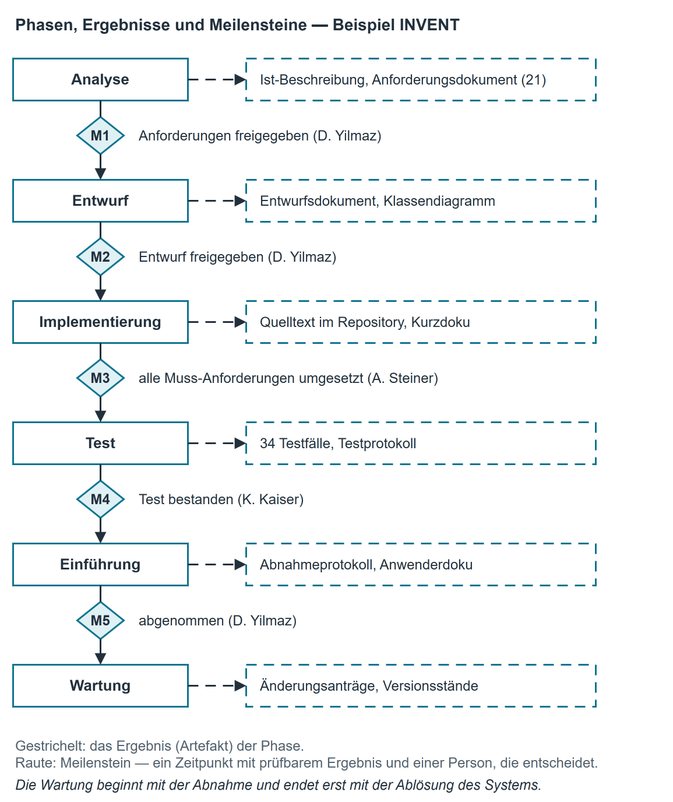

# Phasenkonzept der Softwareentwicklung

## Was ein Phasenkonzept ist

Ein Softwareprojekt wird nicht in einem Zug erledigt. Es durchläuft **Phasen**: inhaltlich
abgegrenzte Abschnitte, die jeweils eine eigene Frage beantworten und ein eigenes Ergebnis
hinterlassen. Das Phasenkonzept beschreibt, welche Phasen es gibt, was in jeder getan wird, was am
Ende jeder Phase vorliegt und wer es abnimmt.

Wichtig ist die Unterscheidung zwischen Phase und Vorgehensmodell:

| Begriff | Bedeutung |
|---------------------|--------------------------------------------------------------------|
| **Phase** | *Was* inhaltlich getan wird: analysieren, entwerfen, umsetzen, prüfen, einführen, betreuen. |
| **Vorgehensmodell** | *In welcher Reihenfolge und wie oft* die Phasen durchlaufen werden ([Vorgehensmodelle I](vorgehensmodelle_klassisch.md), [II](vorgehensmodelle_iterativ.md) und [III](vorgehensmodelle_agil.md)). |

**Die Phasen kommen in jedem Projekt vor, auch im agilen.** Wer in kurzen Abständen liefert,
durchläuft dieselben Phasen mehrfach und in kleinerem Zuschnitt; er lässt sie nicht weg. Ein Team,
das nie eine Analyse macht, baut trotzdem etwas — es hat die Analyse nur nicht aufgeschrieben und
trägt das Risiko unbemerkt.

### Meilenstein

Ein **Meilenstein** ist ein Zeitpunkt ohne Dauer, an dem ein festgelegtes Ergebnis vorliegt und
eine Entscheidung fällt: weiter, nachbessern oder abbrechen. Ein Meilenstein hat drei Merkmale:

1. Er ist an ein **prüfbares Ergebnis** gebunden („das Anforderungsdokument ist freigegeben"),
   nicht an eine Tätigkeit („wir haben viel besprochen").
2. Er hat eine **Person, die entscheidet**.
3. Er kann **verfehlt** werden. Ein Meilenstein, den man nicht verfehlen kann, ist keiner.

## Die sechs Phasen und ihre Ergebnisse

| Phase | Leitfrage | Tätigkeiten | Ergebnis (Artefakt) | Meilenstein |
|---|---|---|---|---|
| **Analyse** | Was ist heute, was soll werden? | Ist-Zustand erheben, Beteiligte befragen, Ziele klären, Anforderungen sammeln und ordnen | Ist-Beschreibung, [Lastenheft bzw. Pflichtenheft](lastenheft_pflichtenheft.md), Glossar | Anforderungen freigegeben |
| **Entwurf** | Woraus besteht die Lösung? | Bausteine festlegen, Zuständigkeiten schneiden, Datenform und Ablage bestimmen | Entwurfsdokument nach RL-SE-005, Modelle (Klassen-, Aktivitätsdiagramm) | Entwurf freigegeben |
| **Implementierung** | Wie wird es gebaut? | Programmieren, Zwischenstände einchecken, Entwurf nachziehen, wenn abgewichen wird | Quelltext im Repository, Entwicklerdokumentation | Alle Muss-Anforderungen umgesetzt |
| **Test** | Tut es, was verlangt war? | Testfälle aus den Anforderungen ableiten, ausführen, Abweichungen melden und nachprüfen | Testkonzept, Testfälle mit Anforderungsbezug, Testprotokoll | Keine offenen Fehler der oberen Fehlerklassen |
| **Einführung** | Kommt es beim Anwender an? | Bereitstellen, Daten übernehmen, einweisen, Betrieb übergeben | Abnahmeprotokoll, Anwenderdokumentation, Übergabeprotokoll | Abnahme durch den Auftraggeber |
| **Wartung** | Wie bleibt es brauchbar? | Fehler beheben, Änderungswünsche bewerten, Anpassungen an neue Vorgaben | Änderungsanträge, Versionsstände, gepflegte Dokumentation | (laufend, Release-Stände) |

Die Reihenfolge ist die inhaltliche Abhängigkeit, nicht zwingend der Kalender: Man kann nicht
prüfen, was nicht gebaut ist, und nicht bauen, was nicht beschrieben ist. Wie stark die Phasen
sich überlappen und wie oft sie wiederholt werden, entscheidet das Vorgehensmodell.

### Dokumentationspflicht

Für die Campus IT Solutions GmbH gilt **RL-SE-001, Kapitel 4**: Zu jeder Phase gehört mindestens
ein Artefakt, und es entsteht **in** der Phase, nicht nachträglich. Was am Projektende „noch
aufgeschrieben" wird, ist keine Dokumentation, sondern eine Rekonstruktion.

## Beispiel aus der Firma: die Ablösung von INVENT { #die-abloesung-von-invent }

INVENT ist unsere interne Geräteliste: welches Gerät im Haus steht, an welchem Arbeitsplatz und in
welchem Zustand. Sie wurde 2025 abgelöst. Der Phasenplan des Projekts sah so aus.

| Phase | Was das Team tat | Was am Ende vorlag | Meilenstein (Entscheidung durch) |
|---|---|---|---|
| Analyse | Drei Gespräche mit der Technischen Leitung und dem Empfang, alte Liste ausgewertet, 21 Anforderungen aufgeschrieben und priorisiert | Ist-Beschreibung (4 Seiten), Anforderungsdokument mit 21 Anforderungen | **M1** Anforderungen freigegeben (D. Yilmaz) |
| Entwurf | Bausteine geschnitten, Ablageform entschieden (Datei, weil kein Server), Übersicht skizziert | Entwurfsdokument, Klassendiagramm | **M2** Entwurf freigegeben (D. Yilmaz) |
| Implementierung | Umsetzung in zwei Ausbaustufen, wöchentliche Zwischenstände | Quelltext, Kurzdoku im Repository | **M3** Alle Muss-Anforderungen umgesetzt (A. Steiner) |
| Test | 34 Testfälle aus den Anforderungen, zwei Runden | Testprotokoll mit sechs Abweichungen, danach keine offene | **M4** Test bestanden (K. Kaiser) |
| Einführung | Bestand übernommen, zwei Einweisungen von je 30 Minuten | Abnahmeprotokoll, Anwenderdoku (2 Seiten) | **M5** Abgenommen (D. Yilmaz) |
| Wartung | seither vier kleine Änderungen | Änderungsanträge, Version 1.3 | – |

{ .diagramm }

**Was das Projekt gelehrt hat:** Zwischen M1 und M2 lagen elf Arbeitstage, zwischen M3 und M4 nur
vier — und genau dort wurde es eng. Die sechs Abweichungen im Test stammten alle aus zwei
Anforderungen, die bei M1 unscharf formuliert waren („übersichtlich darstellen"). Wer am Anfang
unscharf formuliert, zahlt am Ende im Test.

## Typische Fehler beim Planen von Phasen

| Fehler | Warum er teuer wird |
|---|---|
| Phase ohne Ergebnis geplant („Konzeptphase") | Niemand kann feststellen, ob sie fertig ist. |
| Meilenstein als Zeitraum („KW 46 bis 48") | Ein Meilenstein ist ein Zeitpunkt; ein Zeitraum ist eine Phase. |
| Test erst nach der Implementierung gedacht | Die Testfälle entstehen aus den Anforderungen und können ab der Analyse geschrieben werden. |
| Einführung vergessen | Übernahme der Altdaten und Einweisung brauchen Zeit; sie stehen selten im Angebot. |
| Wartung vergessen | Der größte Teil der Lebensdauer einer Software liegt nach der Einführung. |
| Entscheider nicht benannt | Ein Meilenstein ohne entscheidende Person verschiebt sich lautlos. |

## Kurzreferenz

| Prüfen Sie am Phasenplan | Frage |
|---|---|
| Vollständigkeit | Kommen alle sechs Phasen vor, auch Einführung und Wartung? |
| Ergebnis | Steht zu jeder Phase mindestens ein Artefakt? |
| Meilenstein | Ist jeder Meilenstein ein Zeitpunkt mit prüfbarem Ergebnis? |
| Entscheider | Steht zu jedem Meilenstein, wer entscheidet? |
| Abhängigkeit | Ist erkennbar, was vor was fertig sein muss? |
| Verfehlbarkeit | Kann jeder Meilenstein verfehlt werden? |
| Sprache | Sind die Ergebnisse als Substantive benannt („Testprotokoll") und nicht als Absichten? |

Typische Fehler: Phasen ohne Ergebnis; Meilenstein als Zeitraum; Test und Einführung zu knapp
geplant; Wartung fehlt; Entscheider nicht benannt.
