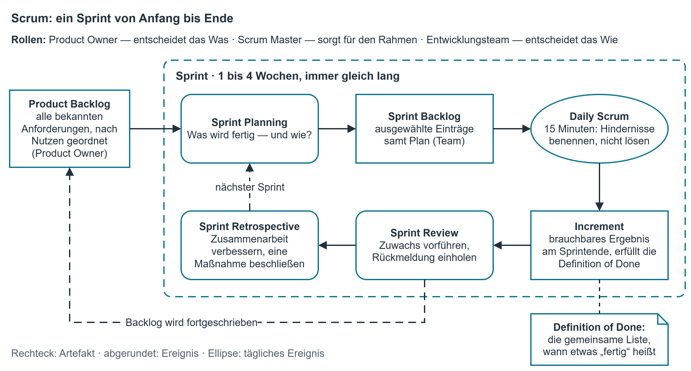

# Vorgehensmodelle III — agil (Scrum, XP)

## Was „agil" bedeutet

Agile Vorgehensweisen sind konsequent iterativ-inkrementell ([Vorgehensmodelle II — iterativ](vorgehensmodelle_iterativ.md)) und ordnen die
Zusammenarbeit anders: Nicht der Plan steuert das Projekt, sondern das, was am Ende jedes kurzen
Abschnitts tatsächlich funktioniert. Grundlage ist das **Agile Manifest** (2001) mit vier
Wertepaaren. Beachten Sie: Es wird nichts abgeschafft — die rechte Seite bleibt wertvoll, die
linke wird höher gewichtet.

| Höher gewichtet | gegenüber |
|---|---|
| Menschen und Zusammenarbeit | Prozessen und Werkzeugen |
| Funktionierende Software | umfassender Dokumentation |
| Zusammenarbeit mit dem Kunden | Vertragsverhandlung |
| Reagieren auf Veränderung | Befolgen eines Plans |

!!! warning "Häufiges Missverständnis"
    „Agil" heißt nicht „ohne Dokumentation" und nicht „ohne Plan".
    Geplant wird häufiger, aber kürzer; dokumentiert wird das, was gebraucht wird. Die
    Dokumentationspflicht der Firma (RL-SE-001, Kapitel 4) gilt in agilen Projekten unverändert.

## Scrum

Scrum ist ein Rahmenwerk, kein fertiger Prozess. Die Arbeit läuft in **Sprints**: gleich langen
Abschnitten von ein bis vier Wochen, an deren Ende ein brauchbarer Zuwachs steht.

{ .diagramm }

### Rollen (Verantwortlichkeiten)

| Rolle | Verantwortet | Verantwortet **nicht** |
|---|---|---|
| **Product Owner** | den Nutzen: Inhalt und Reihenfolge des Product Backlog; entscheidet, was gebaut wird | wie gebaut wird; Zusagen an den Kunden über den Kopf des Teams hinweg |
| **Scrum Master** | dass Scrum verstanden und gelebt wird; räumt Hindernisse aus; schützt das Team | fachliche Entscheidungen; Aufgabenverteilung |
| **Entwicklungsteam** (Developers) | wie gebaut wird, die Schätzung, die Qualität, den Sprintzuwachs | die Priorisierung des Backlogs |

Das Team ist klein (Richtwert bis zehn Personen), arbeitet **selbstorganisiert** und ist
**funktionsübergreifend** besetzt: Alle Fähigkeiten, die für einen fertigen Zuwachs gebraucht
werden, sind im Team vorhanden.

### Ereignisse

| Ereignis | Wann | Zweck | Richtwert Dauer (4-Wochen-Sprint) |
|---|---|---|---|
| **Sprint** | der Rahmen selbst | einen brauchbaren Zuwachs erzeugen | 1 bis 4 Wochen, immer gleich lang |
| **Sprint Planning** | zu Beginn | Was wird in diesem Sprint fertig, und wie? | bis 8 Stunden |
| **Daily Scrum** | täglich | Abgleich im Team, Hindernisse benennen | 15 Minuten |
| **Sprint Review** | am Ende | Zuwachs vorführen, Rückmeldung der Beteiligten einholen | bis 4 Stunden |
| **Sprint Retrospective** | nach dem Review | Zusammenarbeit verbessern; eine Maßnahme beschließen | bis 3 Stunden |

Im **Daily** werden Hindernisse benannt, nicht gelöst — dieselbe Regel wie im Standup der Firma
(RL-SE-004, 5.2).

### Artefakte

| Artefakt | Inhalt | Gehört |
|---|---|---|
| **Product Backlog** | alle bekannten Anforderungen, nach Nutzen geordnet, oben fein, unten grob | Product Owner |
| **Sprint Backlog** | die für diesen Sprint ausgewählten Einträge samt Plan | Entwicklungsteam |
| **Increment** (Produktinkrement) | das brauchbare Ergebnis am Sprintende, einschließlich aller früheren | Team |

Dazu die **Definition of Done**: eine gemeinsame, verbindliche Liste dessen, was erfüllt sein
muss, damit ein Eintrag „fertig" heißt (gebaut, geprüft, dokumentiert, eingecheckt). Ohne sie
bedeutet „fertig" bei jedem etwas anderes — und der Zuwachs ist nicht auslieferbar.

Anforderungen werden in Scrum häufig als **User Story** formuliert: *Als &lt;Rolle&gt; möchte ich
&lt;Funktion&gt;, damit &lt;Nutzen&gt;*, mit mindestens einem Akzeptanzkriterium (RL-SE-001, 7.2.2).

| Stärken | Grenzen |
|---|---|
| Sehr schnelle Rückmeldung; Fehlentwicklungen fallen nach Wochen auf, nicht nach Monaten | Fester Preis und fester Umfang zugleich sind kaum zusagbar |
| Änderungen sind der Normalfall, nicht die Störung | Braucht einen verfügbaren, entscheidungsfähigen Product Owner |
| Hohe Eigenverantwortung, hohe Motivation | Ungeeignet für Vorhaben mit langem Nachweis- und Zulassungsbedarf |
| Reihenfolge nach Nutzen: das Wichtigste entsteht zuerst | Verlangt Disziplin; ohne Definition of Done entsteht unfertige Software |

## Extreme Programming (XP)

XP (Beck, 1999) ist enger an der Programmierarbeit als Scrum und liefert die **Praktiken**, die
in vielen Teams neben Scrum verwendet werden.

| Praktik | Inhalt | Warum |
|---|---|---|
| **Pair Programming** | zwei Personen, ein Rechner, wechselnde Rollen | ständiges Review, Wissen verteilt sich |
| **Testgetriebene Entwicklung** (TDD) | erst den Test schreiben, dann den Code | zwingt zu prüfbaren Anforderungen und lauffähigen Ergebnissen |
| **Continuous Integration** | mehrmals täglich zusammenführen und automatisch bauen | Integrationsfehler bleiben klein |
| **Refactoring** | Struktur verbessern, ohne das Verhalten zu ändern | hält den Code änderbar |
| **Einfaches Design** | nur bauen, was heute gebraucht wird | spart Aufwand für Vermutungen |
| **Gemeinsame Verantwortung für den Code** | jede Person darf jede Stelle ändern | keine Wissensinseln |
| **Kunde vor Ort** | Ansprechperson jederzeit erreichbar | Fragen kosten Minuten statt Tage |
| **Kurze Releasezyklen** | häufig ausliefern | früher Nutzen, frühe Rückmeldung |
| **Verbindliche Programmierregeln** | ein gemeinsamer Stil | fremder Code bleibt lesbar |
| **Nachhaltiges Tempo** | keine Dauer-Überstunden | Qualität sinkt mit der Erschöpfung |

Scrum und XP schließen einander nicht aus: Scrum ordnet die Zusammenarbeit, XP die Handwerksarbeit
am Code. Die Firma verwendet Pair Programming, Continuous Integration und verbindliche
Programmierregeln unabhängig vom gewählten Vorgehensmodell.

## Beispiel aus der Firma: das Wartungsband von INVENT

Die Ablösung von INVENT ([Beispiel aus der Firma: die Ablösung von INVENT](phasenkonzept.md#die-abloesung-von-invent)) lief klassisch. Die **Wartung danach** läuft agil, und das
aus einem sachlichen Grund: Was als Nächstes geändert wird, weiß niemand im Voraus — es ergibt
sich aus dem, was im Haus auffällt.

| Element | Umsetzung bei uns |
|---|---|
| Backlog | eine geordnete Liste im Servicedesk; Product Owner ist D. Yilmaz |
| Sprint | zwei Wochen, feste Länge |
| Review | 20 Minuten im Firmenmeeting, Vorführung am laufenden Stand |
| Retrospektive | 15 Minuten, eine Maßnahme, Keep/Drop/Try (RL-SE-004, 8.2) |
| Definition of Done | gebaut ohne Warnungen, Testfälle grün, Kurzdoku ergänzt, eingecheckt mit Vorgangsnummer |

Was dabei auffiel: Solange die Definition of Done fehlte, galt „fertig" für die einen als
„läuft bei mir" und für die anderen als „ist eingeführt". Erst der geschriebene Satz beendete
den Streit.

## Auswahl: klassisch oder agil?

Kein Modell ist grundsätzlich besser. Entschieden wird am Fall, mit denselben Kriterien wie in
[Auswahl: woran man ein klassisches Modell erkennt](vorgehensmodelle_klassisch.md#woran-man-ein-klassisches-modell-erkennt), ergänzt um:

| Frage an das Projekt | Spricht für agil | Spricht für klassisch |
|---|---|---|
| Sind die Anforderungen stabil? | nein, sie entstehen unterwegs | ja |
| Ist der Auftraggeber regelmäßig verfügbar? | ja, wöchentlich oder öfter | nein, nur an Meilensteinen |
| Was ist fest: Termin, Preis oder Umfang? | Termin und Preis, Umfang darf atmen | alle drei sollen fest sein |
| Wird ein Nachweis für Dritte gebraucht? | nein | ja (Audit, Behörde, Vertrag) |
| Kann in Teilen ausgeliefert werden? | ja | nein, nur als Ganzes brauchbar |
| Wie erfahren ist das Team in Selbstorganisation? | erfahren | wenig erfahren, braucht Führung |

**Mischformen sind der Normalfall.** Häufig: klassische Anforderungs- und Entwurfsphase mit
Freigabe, danach iterative Umsetzung in Inkrementen mit Review am Ende jedes Abschnitts. Wichtig
ist nicht die Reinheit des Modells, sondern dass die Wahl **begründet** und für alle Beteiligten
verbindlich ist.

## Kurzreferenz

| Scrum in drei Listen | |
|---|---|
| **Rollen** | Product Owner (was), Scrum Master (Rahmen), Entwicklungsteam (wie) |
| **Ereignisse** | Sprint, Sprint Planning, Daily Scrum, Sprint Review, Sprint Retrospective |
| **Artefakte** | Product Backlog, Sprint Backlog, Increment (dazu Definition of Done) |

| Prüfen Sie an einer Vorgehensentscheidung | Frage |
|---|---|
| Kriterien | Sind die Kriterien vor der Entscheidung festgelegt worden? |
| Beleg | Steht zu jedem Kriterium, woraus im Auftrag es sich ergibt? |
| Alternative | Ist mindestens ein verworfenes Modell mit Begründung genannt? |
| Folgen | Ist gesagt, was die Wahl für Termine, Abnahme und Dokumentation bedeutet? |
| Verbindlichkeit | Wissen alle Beteiligten, was jetzt gilt? |

Merksätze: Agil heißt häufiger planen, nicht weniger planen. — Fertig ist, was der Definition of
Done entspricht. — Der Product Owner entscheidet das Was, das Team das Wie.
