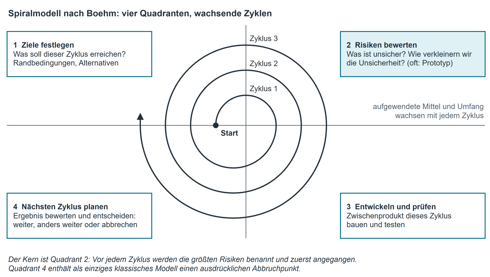

# Vorgehensmodelle II — iterativ, Prototyping, Spiralmodell

## Der Grundgedanke

Die [klassischen Modelle](vorgehensmodelle_klassisch.md) setzen voraus, dass zu Beginn feststeht, was entstehen soll.
Oft steht das nicht fest: Der Auftraggeber kennt seinen Bedarf erst, wenn er etwas sieht; die
Technik ist neu; das Umfeld ändert sich während der Bauzeit. Die iterativen Modelle antworten
darauf mit einem anderen Zuschnitt der Arbeit: **nicht einmal groß, sondern mehrfach klein.**

Zwei Begriffe werden ständig verwechselt:

| Begriff | Bedeutung | Bild |
|---|---|---|
| **Iteration** | ein wiederholter Durchlauf durch die Phasen; das Ergebnis wird **verbessert** | dasselbe Bild noch einmal malen, jetzt schärfer |
| **Inkrement** | ein abgeschlossener Zuwachs an Funktion; das Ergebnis wird **größer** | ein weiteres Zimmer an das Haus bauen |

**Iterativ-inkrementelle Entwicklung** verbindet beides: In jedem Durchlauf entsteht ein
lauffähiger Zuwachs, und zugleich wird das Vorhandene überarbeitet. Am Ende jedes Durchlaufs
steht etwas, das man vorführen kann — das ist der entscheidende Unterschied zum Wasserfall, bei
dem am Ende jeder Phase ein Dokument steht.

| Stärken | Grenzen |
|---|---|
| Der Auftraggeber sieht früh und regelmäßig lauffähige Software | Aufwand und Endtermin sind zu Beginn schwerer zu nennen |
| Änderungen sind vorgesehen und kosten weniger | Ohne feste Priorisierung wächst der Umfang unbemerkt |
| Risiken zeigen sich früh, weil früh gebaut wird | Erfordert Disziplin: jeder Zuwachs muss wirklich fertig sein |
| Teilnutzen kann vor dem Projektende in Betrieb gehen | Mehr Abstimmungs- und Testaufwand je Durchlauf |
| Falsche Annahmen werden früh widerlegt | Architekturfehler können sich über viele Durchläufe fortpflanzen |

**Voraussetzung:** eine belastbare **Priorisierung**
([Attribute je Anforderung und Priorisierung](lastenheft_pflichtenheft.md#attribute-je-anforderung-und-priorisierung)). Wer nicht sagen kann, was
zuerst gebaut wird, kann nicht in Inkrementen arbeiten.

## Das Prototypenmodell { #das-prototypenmodell }

Ein **Prototyp** ist ein bewusst unvollständiges Vorabmodell, das eine bestimmte Frage
beantworten soll — und sonst nichts. Er wird gebaut, um Unsicherheit zu beseitigen, nicht um
Funktion zu liefern.

| Art | Zweck | Was danach damit geschieht |
|---|---|---|
| **Wegwerf-Prototyp** (Rapid Prototyping) | Eine Frage schnell klären: Verstehen wir den Bedarf? Reicht die Bedienung? | wird weggeworfen; die Erkenntnis bleibt |
| **Explorativer Prototyp** | Anforderungen mit dem Anwender erarbeiten, indem man ihm etwas vorlegt | dient als Vorlage der Anforderungsdokumentation |
| **Experimenteller Prototyp** | Eine technische Machbarkeit prüfen: Trägt der geplante Weg? | Ergebnis geht in den Entwurf ein |
| **Evolutionärer Prototyp** | Ein erster Stand, der schrittweise zum Produkt ausgebaut wird | wird weiterentwickelt |

!!! warning "Die wichtigste Regel"
    Vor dem Bau wird festgelegt, **welche Frage** der Prototyp beantwortet
    und **was mit ihm geschieht**. Ein Wegwerf-Prototyp, den jemand später doch in Betrieb nimmt,
    ist die häufigste Ursache für unwartbare Software — er war nie dafür gebaut.

| Stärken | Grenzen |
|---|---|
| Anwender können sich zu etwas Sichtbarem äußern statt zu Papier | Der Auftraggeber hält den Prototyp für fast fertig und drängt auf Übernahme |
| Missverständnisse fallen sehr früh auf | Aufwand, der nicht ins Produkt eingeht |
| Technische Risiken werden vorab geklärt | Verführt zum Weglassen der Dokumentation |

Das Prototypenmodell ist selten ein Vorgehensmodell für ein ganzes Projekt. Es wird meist **in**
ein anderes Modell eingebaut: ein Prototyp in der Analysephase, dann klassisch oder iterativ
weiter.

## Das Spiralmodell

Das Spiralmodell (Boehm, 1988) ist das **risikoorientierte** Modell. Das Projekt läuft in
Zyklen; jeder Zyklus durchläuft dieselben vier Quadranten, und die Spirale wird mit jedem Zyklus
weiter — Umfang und aufgewendete Mittel wachsen.

{ .diagramm }

| Quadrant | Frage | Ergebnis |
|---|---|---|
| 1 **Ziele festlegen** | Was soll dieser Zyklus erreichen, unter welchen Randbedingungen, welche Alternativen gibt es? | Zielbeschreibung des Zyklus |
| 2 **Risiken bewerten** | Was ist an diesem Zyklus unsicher? Wie können wir die Unsicherheit verkleinern? | Risikoliste, oft ein Prototyp zur Klärung |
| 3 **Entwickeln und prüfen** | Das Zwischenprodukt dieses Zyklus bauen und testen | lauffähiger Zwischenstand |
| 4 **Planen des nächsten Zyklus** | Ergebnis bewerten, entscheiden: weiter, anders weiter oder abbrechen | Plan des nächsten Zyklus, Entscheidung |

**Der Kern ist Quadrant 2.** Kein anderes Modell verlangt ausdrücklich, dass vor jedem Zyklus die
größten Risiken benannt und zuerst angegangen werden. Der vierte Quadrant enthält als einziges
klassisches Modell einen ausdrücklichen **Abbruchpunkt**: Ein Projekt, das sich als nicht
tragfähig erweist, wird beendet, bevor das Geld ausgegeben ist.

| Stärken | Grenzen |
|---|---|
| Risiken werden systematisch und früh behandelt | Aufwendig; lohnt sich erst bei großen Vorhaben |
| Prototypen sind eingebaut, nicht Ausnahme | Erfordert Erfahrung in der Risikobewertung |
| Abbruch ist eine vorgesehene, geordnete Möglichkeit | Kosten und Endtermin bleiben lange unscharf |
| Kombinierbar mit klassischem und agilem Vorgehen | Für kleine Projekte deutlich zu schwer |

## Vergleich der drei

| | **Iterativ-inkrementell** | **Prototypenmodell** | **Spiralmodell** |
|---|---|---|---|
| Treibende Frage | Was liefern wir als Nächstes? | Was wissen wir noch nicht? | Was ist gerade das größte Risiko? |
| Ergebnis je Durchlauf | lauffähiger Zuwachs | Erkenntnis (evtl. Wegwerf-Stand) | bewerteter Zwischenstand plus Entscheidung |
| Kunde sieht etwas | am Ende jedes Durchlaufs | sehr früh, unvollständig | am Ende jedes Zyklus |
| Umgang mit Änderung | eingeplant | Zweck der Übung | über die Zyklusplanung |
| Aufwand für Organisation | mittel | gering | hoch |
| Passt zu | wachsendem Bedarf, Teillieferungen | unklarem Bedarf, unklarer Technik | großen, riskanten Vorhaben |

## Beispiel aus der Firma: der zweite Anlauf bei INVENT

Die Ablösung von INVENT ([Beispiel aus der Firma: die Ablösung von INVENT](phasenkonzept.md#die-abloesung-von-invent),
[Beispiel aus der Firma: warum INVENT klassisch geplant wurde](vorgehensmodelle_klassisch.md#warum-invent-klassisch-geplant-wurde)) lief klassisch — mit einer Ausnahme, die zeigt, wozu
ein Prototyp gut ist. Bei der Anforderung „Zustand eines Geräts erfassen" war unklar, welche
Zustände die Kolleginnen und Kollegen im Alltag überhaupt unterscheiden. Der Auftraggeber nannte
vier, der Empfang nannte sieben, und beide Listen überschnitten sich nur teilweise.

Statt zu diskutieren, baute das Team in zwei Stunden einen **Wegwerf-Prototyp**: eine einzige
Bildschirmmaske mit den sieben Zuständen, die eine Woche lang neben der alten Liste mitgeführt
wurde. Ergebnis: Drei Zustände wurden nie verwendet, zwei bedeuteten dasselbe. Aus sieben wurden
vier — und die Anforderung war entschieden statt beschlossen.

**Festgehalten wurde vorher**, in zwei Sätzen im Arbeitsplan: *Der Prototyp beantwortet die
Frage, welche Zustände tatsächlich unterschieden werden. Er wird danach gelöscht und nicht
weiterverwendet.* Genau dieser zweite Satz ist die Regel aus dem Abschnitt [Das Prototypenmodell](#das-prototypenmodell).

## Kurzreferenz

| Modell | Kern in einem Satz | Dafür | Dagegen |
|---|---|---|---|
| **Iterativ-inkrementell** | mehrfach kleine, lauffähige Zuwächse statt eines großen Wurfs | frühe Rückmeldung, Änderungen eingeplant | Endtermin und Umfang schwerer zu fixieren |
| **Prototyping** | ein unvollständiges Modell beantwortet eine benannte Frage | klärt unklaren Bedarf und unklare Technik früh | Prototyp wird für fast fertig gehalten |
| **Spiralmodell** | Zyklen aus Ziele, Risiken, Bauen, Planen | Risiken zuerst, geordneter Abbruch möglich | schwer, nur für große Vorhaben |

Merksätze: Iteration verbessert, Inkrement vergrößert. — Zu jedem Prototyp gehört vorher die
Frage, die er beantwortet, und die Entscheidung, was mit ihm geschieht. — Das Spiralmodell ist
das einzige klassische Modell, in dem „abbrechen" ein geplanter Ausgang ist.
