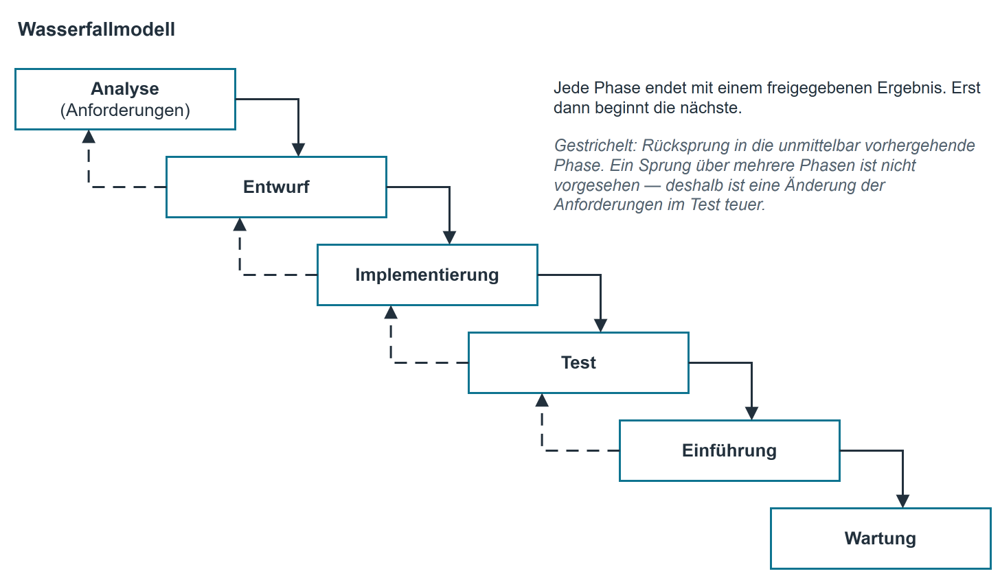
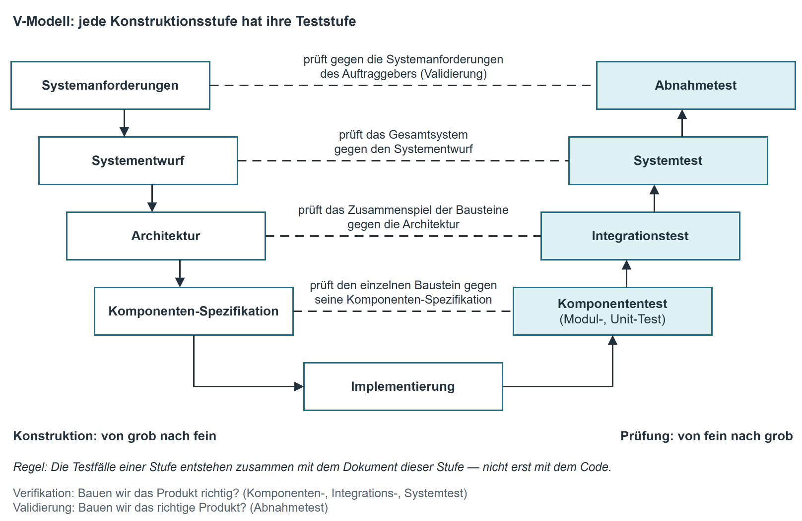

# Vorgehensmodelle I — klassisch (Wasserfall, V-Modell)

## Was ein Vorgehensmodell ist

Ein **Vorgehensmodell** legt fest, in welcher Reihenfolge, wie oft und mit welchen Übergaben die
Phasen eines Projekts ([Phasenkonzept](phasenkonzept.md)) durchlaufen werden. Es beantwortet nicht, *was* getan wird —
das tun die Phasen —, sondern *wie* die Arbeit organisiert ist: wann entschieden wird, wann
geliefert wird, wann der Kunde etwas sieht und wann eine Änderung noch angenommen werden kann.

**Klassisch (plangetrieben)** heißen die Modelle, die die Phasen einmal und der Reihe nach
durchlaufen und jede Phase mit einem freigegebenen Dokument abschließen. Ihr Grundgedanke: Erst
denken, dann bauen; wer vollständig beschreibt, was entstehen soll, kann Aufwand, Termin und
Preis vorher nennen.

## Das Wasserfallmodell

Die Phasen folgen aufeinander wie Stufen eines Wasserfalls: Jede beginnt erst, wenn die vorige
mit einem freigegebenen Ergebnis abgeschlossen ist. Das Ergebnis jeder Phase ist die Eingabe der
nächsten.

{ .diagramm }

In der praktisch verwendeten Fassung (nach Royce, 1970, und den späteren Ausprägungen) ist ein
**Rücksprung in die unmittelbar vorhergehende Phase** vorgesehen: Wer im Test merkt, dass der
Entwurf nicht trägt, geht in den Entwurf zurück. Ein Sprung über mehrere Phasen ist nicht
vorgesehen — und genau daraus entsteht die bekannte Schwäche.

| Stärken | Grenzen |
|---|---|
| Einfach zu verstehen und zu planen; wenig Organisationsaufwand | Anforderungen müssen zu Beginn vollständig und stabil sein |
| Klare Meilensteine und Freigaben; für den Auftraggeber gut nachvollziehbar | Der Kunde sieht erst spät lauffähige Software |
| Aufwand, Termin und Preis lassen sich früh nennen (Festpreis) | Späte Änderungen sind teuer: Je später ein Fehler auffällt, desto mehr ist darauf aufgebaut |
| Dokumentation entsteht ohnehin und ist vollständig | Fehler der Analyse zeigen sich erst im Test |
| Personalwechsel ist verkraftbar, weil alles schriftlich vorliegt | Risiken werden nicht eigens behandelt |

**Wann es passt:** kleine bis mittlere Projekte mit stabilen, gut verstandenen Anforderungen;
Festpreisverträge; gesetzliche oder vertragliche Nachweispflichten; Ablösung eines Systems, dessen
Vorgänger bereits erschöpfend beschrieben ist.

## Das V-Modell

Das V-Modell nimmt die Phasenfolge des Wasserfalls und stellt sie als V dar. Der **linke Ast**
beschreibt die Lösung von grob nach fein, der **rechte Ast** prüft sie von fein nach grob. Jede
Stufe des linken Astes hat auf gleicher Höhe eine **Teststufe**, die genau gegen das Dokument
dieser Stufe prüft. An der Spitze des V steht die Implementierung.

{ .diagramm }

| Linker Ast (Konstruktion) | Erzeugt | Rechter Ast (Prüfung) | Prüft gegen |
|---|---|---|---|
| Systemanforderungen | Lasten-/Pflichtenheft: was das System leisten soll | **Abnahmetest** | die Systemanforderungen des Auftraggebers, in dessen Umgebung |
| Systementwurf | Gliederung des Gesamtsystems: Teilsysteme, Schnittstellen nach außen | **Systemtest** | das Gesamtsystem gegen den Systementwurf, in einer produktionsnahen Umgebung |
| Architektur | Bausteine und ihr Zusammenspiel | **Integrationstest** | das Zusammenspiel der Bausteine gegen die Architektur |
| Komponenten-Spezifikation | Aufbau und Verhalten jedes einzelnen Bausteins | **Komponententest** (Modul-, Unit-Test) | den einzelnen Baustein gegen seine Komponenten-Spezifikation |
| Implementierung | Quelltext | – | Spitze des V: Hier wird gebaut, geprüft wird auf dem rechten Ast |

Zwei Begriffe gehören dazu und werden gern geprüft:

- **Verifikation** — „Bauen wir das Produkt richtig?" Der Vergleich gegen die eigene Spezifikation
  (Komponenten-, Integrations-, Systemtest).
- **Validierung** — „Bauen wir das richtige Produkt?" Der Vergleich gegen den tatsächlichen Bedarf
  des Anwenders (Abnahmetest).

**Der eigentliche Gewinn des V-Modells** liegt nicht in der Zeichnung, sondern in einer Regel:
Die Testfälle einer Stufe werden **zusammen mit dem Dokument dieser Stufe** geschrieben, also
lange vor der Implementierung. Wer die Abnahmetestfälle formuliert, während er die Anforderungen
aufschreibt, merkt sofort, welche Anforderung nicht prüfbar ist
([Wann eine Anforderung prüfbar ist](lastenheft_pflichtenheft.md#wann-eine-anforderung-pruefbar-ist)).

| Stärken | Grenzen |
|---|---|
| Jede Stufe hat eine zugeordnete Prüfung; Testlücken fallen auf | Erbt die Starrheit des Wasserfalls: eine Anforderungsänderung wirkt bis in alle Stufen |
| Testfälle entstehen früh und schärfen die Anforderungen | Hoher Dokumentationsaufwand, für kleine Vorhaben zu schwer |
| Trennung von Verifikation und Validierung ist explizit | Auch hier sieht der Kunde spät lauffähige Software |
| Nachweisfähig gegenüber Auditoren und Behörden | Setzt voraus, dass die Anforderungen früh stabil sind |

**Wann es passt:** sicherheits-, sicherheitskritische oder nachweispflichtige Systeme (Medizin,
Fahrzeug, Behörde), Projekte mit externer Prüfung, Vorhaben, bei denen ein Fehler im Betrieb
teuer oder gefährlich ist. In deutschen Behördenprojekten begegnet Ihnen das **V-Modell XT** als
verbindliche Ausprägung.

## Beispiel aus der Firma: warum INVENT klassisch geplant wurde { #warum-invent-klassisch-geplant-wurde }

Bei der Ablösung von INVENT ([Beispiel aus der Firma: die Ablösung von INVENT](phasenkonzept.md#die-abloesung-von-invent)) hat die Projektleitung das Wasserfallmodell gewählt und
die Wahl in drei Sätzen begründet:

> Der Gegenstand ist klein und vollständig bekannt; die alte Liste liegt vor und beschreibt den
> Bedarf fast vollständig. Es gibt genau einen Auftraggeber im Haus, der jederzeit entscheiden
> kann. Wir brauchen einen festen Termin, weil die Inventur im Herbst darauf aufsetzt.

Was das Projekt trotzdem gelernt hat: Zwei unscharf formulierte Anforderungen aus der Analyse
verursachten alle sechs Abweichungen im Test. Ein V-Modell hätte das früher sichtbar gemacht —
denn zu einer Anforderung wie „übersichtlich darstellen" lässt sich kein Abnahmetestfall
schreiben, und genau daran wäre sie aufgefallen.

## Auswahl: woran man ein klassisches Modell erkennt { #woran-man-ein-klassisches-modell-erkennt }

| Frage an das Projekt | Spricht für klassisch | Spricht dagegen |
|---|---|---|
| Sind die Anforderungen zu Beginn bekannt und stabil? | ja | nein, sie entstehen erst |
| Gibt es einen Festpreis oder einen festen Abgabetermin? | ja | Budget wächst mit dem Erkenntnisstand |
| Ist ein schriftlicher Nachweis gefordert (Audit, Behörde, Vertrag)? | ja | keine Nachweispflicht |
| Wie oft kann der Auftraggeber mitwirken? | selten, aber verlässlich | ständig verfügbar |
| Wie neu ist die Technik für uns? | bekannt | unbekannt, Risiko hoch |
| Was kostet ein Fehler im Betrieb? | viel | wenig, schnell korrigierbar |

## Kurzreferenz

| Modell | Kern in einem Satz | Stärkstes Argument dafür | Stärkstes Argument dagegen |
|---|---|---|---|
| **Wasserfall** | Phasen genau einmal, der Reihe nach, jede mit Freigabe abgeschlossen | Planbarkeit und Festpreis | Änderungen spät und teuer |
| **V-Modell** | Wasserfall mit einer Teststufe je Konstruktionsstufe | Jede Stufe hat ihre Prüfung, Testfälle entstehen früh | hoher Dokumentationsaufwand, unverändert starr |

Merksätze: Verifikation prüft gegen die Spezifikation, Validierung gegen den Bedarf. — Testfälle
werden mit dem Dokument geschrieben, gegen das sie prüfen, nicht erst mit dem Code. — Ein
klassisches Modell ist nicht altmodisch, sondern die richtige Wahl, wenn der Gegenstand
feststeht.
