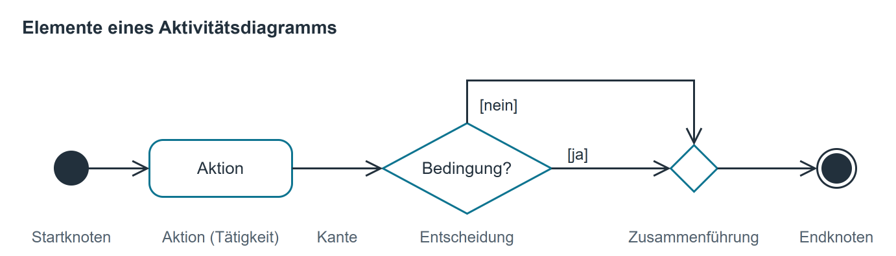
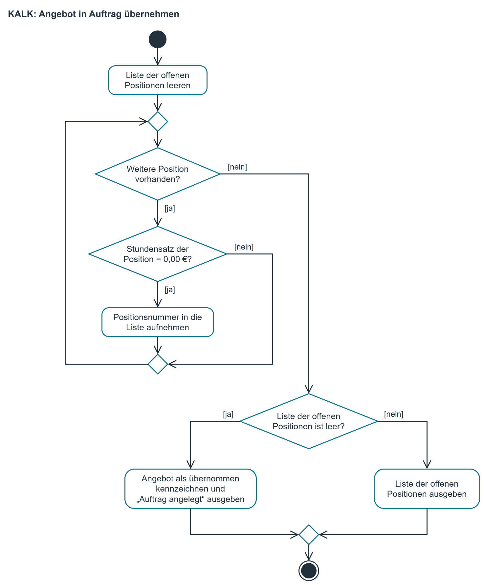
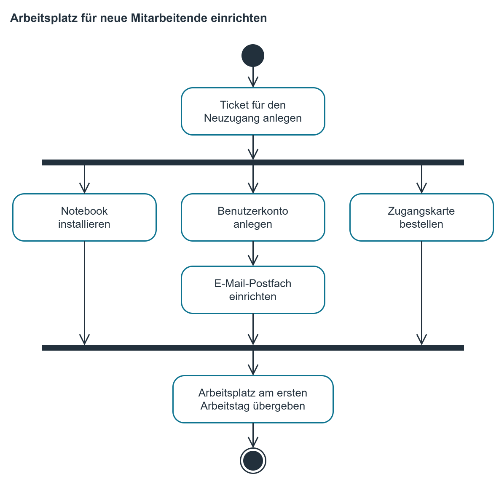
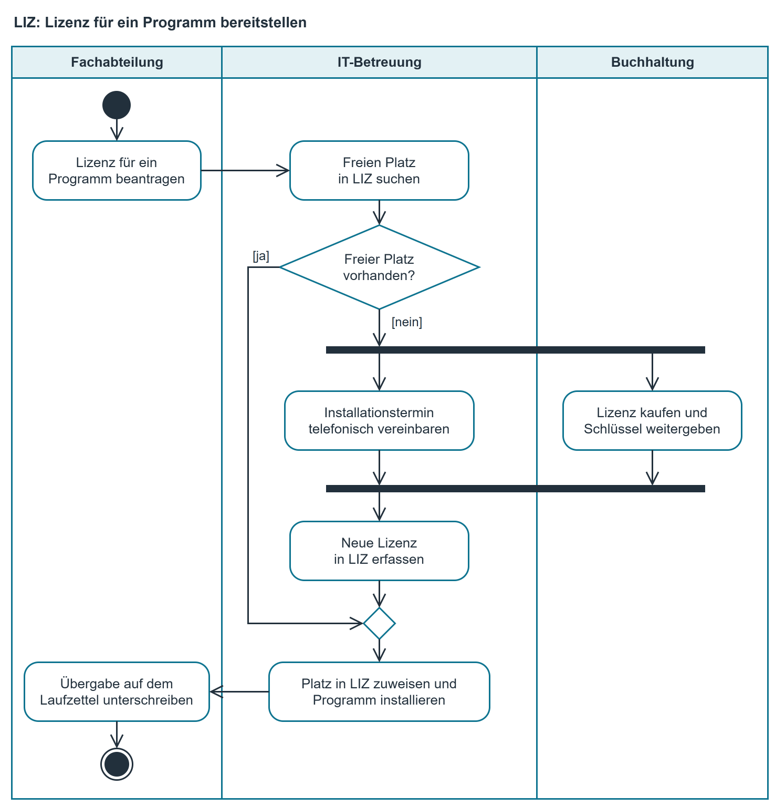

# Aktivitätsdiagramm

## Was ein Aktivitätsdiagramm ist

Ein Aktivitätsdiagramm zeigt einen Ablauf als Bild: Was passiert nacheinander, wo wird
entschieden, wo wird etwas wiederholt. Es gehört zur UML, der Standardsprache für die
Modellierung von Software, und ist damit unabhängig von jeder Programmiersprache.

Die Methodenabteilung benutzt Aktivitätsdiagramme immer dann, wenn ein Ablauf mit einem
Auftraggeber abgestimmt werden muss. Ein Bild lässt sich in einer Besprechung gemeinsam ansehen;
eine Textbeschreibung liest jeder für sich und meist anders.

## Notation { #notation }

{ .diagramm }

| Element | Bedeutung |
|--------------------------------------------|-------------------------------------------------------------|
| Startknoten (ausgefüllter Kreis) | Hier beginnt der Ablauf. Genau einer je Diagramm. |
| Aktion (Rechteck mit runden Ecken) | Ein Schritt, der etwas tut. Formulierung als Tätigkeit: „Offene Positionen sammeln“. |
| Entscheidung (Raute, ein Eingang) | Der Ablauf teilt sich. Jede ausgehende Kante wird beschriftet, z. B. [ja] und [nein]. |
| Zusammenführung (Raute, mehrere Eingänge) | Die geteilten Wege laufen wieder zusammen. |
| Kante (Pfeil) | Die Reihenfolge. Pfeile kreuzen sich möglichst nicht. |
| Endknoten (Kreis mit Punkt) | Hier endet der Ablauf. |

## Vorgehen

1. Den Ablauf zuerst in Sätzen aufschreiben oder als [Pseudocode](../algorithmen/pseudocode_struktogramm.md) notieren.
2. Start und Ende festlegen und ganz oben bzw. ganz unten zeichnen.
3. Aktionen in der richtigen Reihenfolge untereinander setzen; eine Aktion, ein Rechteck.
4. Jede Stelle, an der es weitergeht „nur wenn …“, wird eine Raute. Beide Kanten beschriften; die Bedingungen müssen sich ausschließen und alles abdecken.
5. Geteilte Wege wieder zusammenführen, bevor es weitergeht.
6. Wiederholungen als Rücksprung auf eine Zusammenführung oberhalb zeichnen.
7. Zum Schluss mit dem Finger jeden Weg vom Start bis zum Ende abgehen.

## Beispiel aus dem Hausprojekt KALK

Werkzeug KALK, Menüpunkt „Angebot in Auftrag übernehmen“: Ein Angebot darf erst übernommen
werden, wenn jede seiner Positionen einen Stundensatz hat. Fehlt bei einer Position der Satz, wird
eine Liste der offenen Positionen ausgegeben.

{ .diagramm }

## Kurzreferenz

| Prüfen Sie zum Schluss | Frage |
|--------------------|-------------------------------------------------------------|
| Start und Ende | Genau ein Startknoten, mindestens ein Endknoten vorhanden? |
| Rauten | Ist jede ausgehende Kante beschriftet? Schließen sich die Bedingungen aus? |
| Vollständigkeit | Gibt es für jeden möglichen Wert einen Weg? |
| Zusammenführung | Laufen geteilte Wege wieder zusammen, oder enden sie im Nichts? |
| Sackgassen | Führt jeder Weg irgendwann zum Endknoten? |
| Sprache | Ist jede Aktion als Tätigkeit formuliert, nicht als Hauptwort? |

Typische Fehler: Bedingung in ein Rechteck statt in eine Raute geschrieben; nur der ja-Zweig
gezeichnet; Rücksprung direkt in eine Raute statt auf eine Zusammenführung; Schleife ohne
Abbruchbedingung.

## Erweiterung: gleichzeitige Wege und Verantwortungsbereiche

Die Elemente aus dem Abschnitt [Notation](#notation) reichen für einen Ablauf, den eine Stelle
allein abarbeitet. Sobald Dinge nebeneinander laufen und mehrere Abteilungen beteiligt sind,
kommen zwei Erweiterungen dazu: [Parallelität](#parallelitaet) und [Swimlanes](#swimlanes). Das
[Beispiel am Ende](#beispiel-lizenz) zeigt beide zusammen mit den übrigen Elementen.

### Parallelität: Aufteilung und Synchronisation { #parallelitaet }

Laufen Schritte gleichzeitig, wird der Ablauf an einem Balken aufgeteilt und an einem zweiten
Balken wieder zusammengeführt.

| Element | Bedeutung |
|--------------------------------------------|-------------------------------------------------------------|
| Aufteilung (waagerechter Balken, ein Eingang, mehrere Ausgänge) | Ab hier laufen **alle** ausgehenden Wege gleichzeitig. Die Kanten werden **nicht** beschriftet. |
| Synchronisation (waagerechter Balken, mehrere Eingänge, ein Ausgang) | Es geht erst weiter, wenn **alle** eingehenden Wege angekommen sind. |

**Beispiel:** Fängt jemand neu an, richtet die IT-Betreuung den Arbeitsplatz ein. Sobald das
Ticket angelegt ist, wird das Notebook installiert, das Benutzerkonto samt Postfach eingerichtet
und die Zugangskarte bestellt, alles gleichzeitig. Übergeben wird erst, wenn alle drei Dinge
fertig sind.

{ .diagramm }

Die drei Wege laufen nebeneinander, der mittlere hat zwei Schritte nacheinander. Die
Synchronisation wartet auf den Weg, der als letzter fertig wird, gleichgültig welcher es ist. Die
Kanten an den Balken sind nicht beschriftet, weil nichts entschieden wird. Stünde an derselben
Stelle eine Raute, ginge nur **einer** der drei Wege: Der Neuzugang hätte dann zum Beispiel ein
Notebook, aber kein Konto.

**Balken oder Raute?** An dieser Frage entstehen die meisten Fehler.

| Formulierung im Text | Element |
|----------------------------------------------|-----------------------------|
| „wenn … , sonst …", „falls", „je nachdem" | Entscheidung (Raute): genau **ein** Weg wird gegangen |
| „währenddessen", „in der Zwischenzeit", „gleichzeitig", „parallel dazu" | Aufteilung (Balken): **alle** Wege werden gegangen |
| „erst wenn beides fertig ist", „ich warte, bis alles da ist" | Synchronisation (Balken) |
| „die Wege laufen wieder zusammen" nach einer Entscheidung | Zusammenführung (Raute) |

Merksatz: **Raute heißt entweder-oder, Balken heißt sowohl-als-auch.**

Regeln für die Balken:

1. Jede Aufteilung braucht eine Synchronisation. Ein Weg, der aus einem Balken herausläuft und
   nirgends wieder ankommt, ist ein Fehler.
2. Aus einem gleichzeitigen Bereich wird nicht per Entscheidung herausgesprungen. Erst
   zusammenführen, dann entscheiden.

**Zum Schluss prüfen:** Hat jede Aufteilung eine Synchronisation? Sind die Kanten am Balken
unbeschriftet?

### Swimlanes (Verantwortungsbereiche) { #swimlanes }

Eine **Swimlane**, deutsch Verantwortungsbereich, ist eine senkrechte oder waagerechte Spalte mit
Überschrift, wie eine Bahn im Schwimmbecken. Alles, was in dieser Spalte steht, tut die genannte
Stelle. Die Überschrift ist eine Rolle, kein Personenname. So sieht man ohne Zusatztext, wer
welchen Schritt ausführt und wo ein Vorgang von einer Stelle zur nächsten wechselt.

Regeln für Swimlanes:

1. Die Swimlanes werden vor dem Zeichnen festgelegt und danach nicht mehr geändert. Jede Aktion
   steht in genau einer Swimlane, nämlich der der Stelle, die sie ausführt.
2. Eine Kante darf eine Swimlane verlassen. Das ist der übliche Fall: Sie ist die Übergabe von
   einer Stelle an die nächste.
3. Läuft ein Schritt außerhalb des Systems (Anruf, Papier, Zuruf), wird er trotzdem gezeichnet.
   Gerade solche Schritte sind der Grund, warum ein Ablauf aufgeschrieben werden muss.

**Zum Schluss prüfen:** Steht jede Aktion in der Swimlane der Stelle, die sie tut? Ist jede
Überschrift eine Rolle und kein Name?

### Beispiel: eine Lizenz bereitstellen { #beispiel-lizenz }

Die IT-Betreuung führt in der Lizenzübersicht **LIZ** die gekauften Softwarelizenzen des Hauses
(siehe [Klassendiagramm](klassendiagramm.md)). Braucht eine Fachabteilung ein Programm, sucht die
IT-Betreuung zuerst einen freien Platz in LIZ. Gibt es keinen, kauft die Buchhaltung eine neue
Lizenz; in der Zwischenzeit vereinbart die IT-Betreuung telefonisch einen Installationstermin.
Erst wenn beides erledigt ist, wird die neue Lizenz in LIZ erfasst. Zum Schluss bestätigt die
Fachabteilung die Übergabe auf dem Laufzettel.

{ .diagramm }

| Im Diagramm | Was es zeigt |
|--------------------------------------------|-------------------------------------------------------------|
| Drei Swimlanes | Fachabteilung, IT-Betreuung und Buchhaltung; jede Aktion steht bei der Stelle, die sie tut. |
| Kante vom Antrag zur Suche in LIZ | Eine Übergabe: Der Vorgang wechselt von der Fachabteilung zur IT-Betreuung. |
| Raute „Freier Platz vorhanden?“ | Entweder-oder: Mit freiem Platz geht es auf dem [ja]-Weg direkt zur Installation. |
| Balken nach [nein] | Sowohl-als-auch: Kauf und Terminvereinbarung laufen gleichzeitig, in zwei Swimlanes; die Kanten am Balken sind unbeschriftet. |
| Balken vor „Neue Lizenz in LIZ erfassen“ | Synchronisation: Es geht erst weiter, wenn der Schlüssel da ist **und** der Termin steht. |
| Kleine Raute vor der Installation | Zusammenführung: Der [ja]-Weg und der Weg über den Kauf laufen wieder zusammen. |
| Anruf und Laufzettel | Schritte außerhalb von LIZ, die trotzdem zum Ablauf gehören. |
