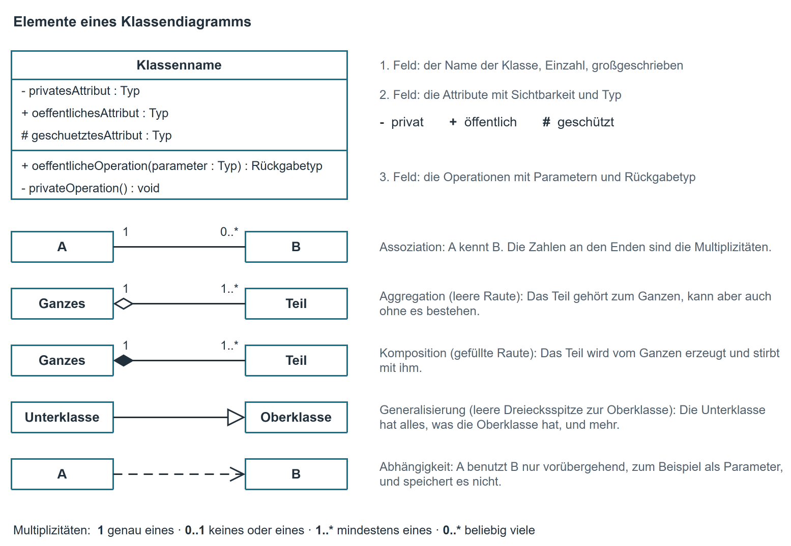
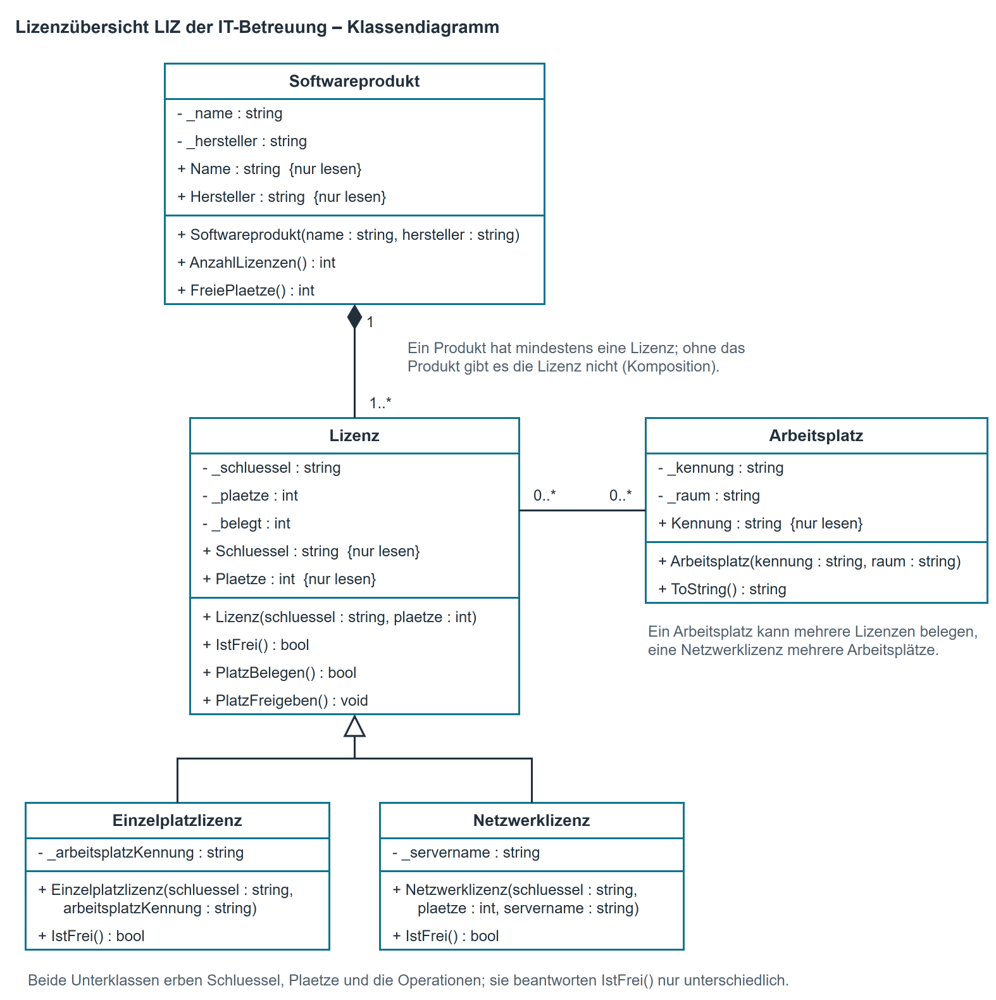
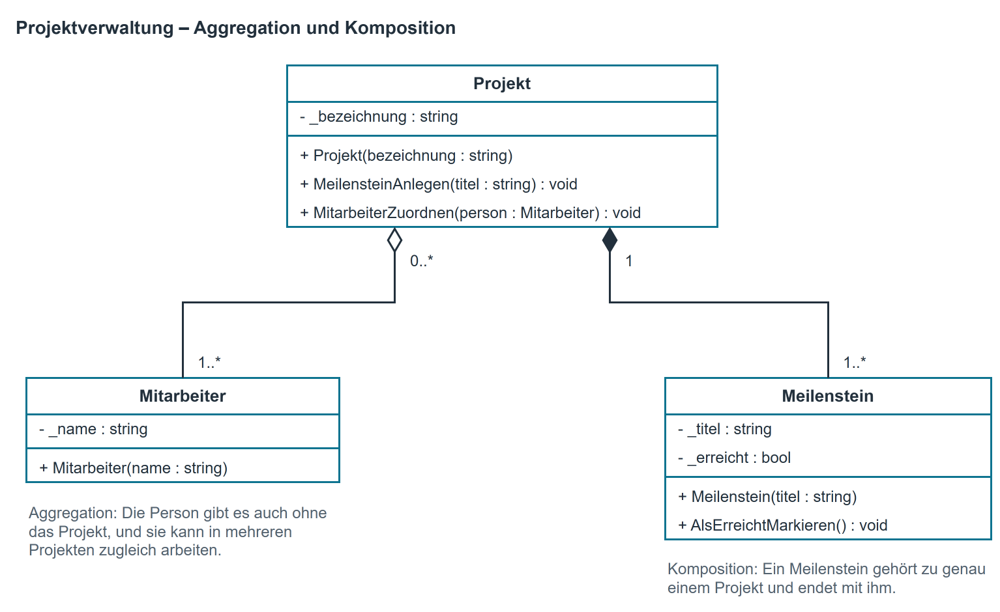

# Klassendiagramm

## Was ein Klassendiagramm ist

Ein Klassendiagramm zeigt, **woraus** ein System besteht und **wie die Teile zusammenhängen**. Es
beantwortet auf einem Blatt: Welche Bausteine gibt es, was weiß jeder davon, was kann er, und
welcher benutzt welchen.

Es beschreibt ausdrücklich keinen Ablauf und keine Reihenfolge. Wer wissen will, was zuerst
passiert, braucht ein [Aktivitätsdiagramm](aktivitaetsdiagramm.md). Wer wissen will, wer das System benutzt,
braucht ein [Use-Case-Diagramm](usecase_diagramm.md). Das Klassendiagramm ist die Bauzeichnung dazwischen:
Es ist das Blatt, das ein fremdes Entwicklungsteam als Erstes verlangt, und das einzige, aus dem
sich ein Aufwand abschätzen lässt.

In der Methodenabteilung entsteht ein Klassendiagramm in zwei Lagen:

- **Vorwärts**, aus einer Beschreibung: Was soll gebaut werden? Das Ergebnis steht im
  Pflichtenheft und wird umgesetzt.
- **Rückwärts**, aus einem vorhandenen Quelltext: Was ist heute da? Das Ergebnis heißt
  Ist-Modell und ist die Grundlage jeder Ablösung eines Altsystems.

Beide Richtungen benutzen dieselbe Notation.

## Notation

{ .diagramm }

| Element | Bedeutung |
|--------------------------------------|-------------------------------------------------------------|
| Klasse (Rechteck mit drei Feldern) | Oben der Name (Einzahl, groß), in der Mitte die Attribute, unten die Operationen. Leere Felder dürfen wegfallen, die Reihenfolge nicht. |
| Attribut | `sichtbarkeit name : Typ`, z. B. `- _plaetze : int`. Ein fester Anfangswert wird angehängt: `= 5000,00`. |
| Operation | `sichtbarkeit name(parameter : Typ) : Rückgabetyp`, z. B. `+ PlatzBelegen() : bool`. Gibt sie nichts zurück, steht dort `void`. |
| Sichtbarkeit | `-` privat (nur innerhalb der Klasse), `+` öffentlich (von außen benutzbar), `#` geschützt (Klasse und Unterklassen). |
| Assoziation (durchgezogene Linie) | Die eine Klasse kennt die andere dauerhaft, weil sie ein Feld von diesem Typ hat. |
| Aggregation (leere Raute am Ganzen) | Ein Teil-Ganzes-Verhältnis. Das Teil kann auch ohne das Ganze bestehen. |
| Komposition (gefüllte Raute am Ganzen) | Ein starkes Teil-Ganzes-Verhältnis: Das Ganze erzeugt das Teil, und mit dem Ganzen ist auch das Teil weg. |
| Generalisierung (leere Dreiecksspitze zur Oberklasse) | Die Unterklasse hat alles, was die Oberklasse hat, und ergänzt oder ändert etwas. |
| Abhängigkeit (gestrichelter Pfeil) | Die eine Klasse benutzt die andere nur vorübergehend, meist als Parameter oder Rückgabewert, und speichert sie nicht. |
| Multiplizität | Steht an beiden Enden einer Verbindung: `1`, `0..1`, `1..*`, `0..*`. |

!!! info "Regel für C#-Eigenschaften"
    Ein privates Feld mit einer öffentlichen Eigenschaft (property)
    davor wird als **ein** Attribut mit der Sichtbarkeit der Eigenschaft dargestellt; das Feld
    dahinter ist eine Umsetzungsfrage. Gibt es nur einen lesenden Zugriff, wird `{nur lesen}`
    angehängt. Nur wenn ausdrücklich der Quelltext Zeile für Zeile abgebildet werden soll, werden
    beide eingetragen.

## Vorgehen

1. **Substantive sammeln.** Aus der Beschreibung oder aus dem Quelltext alle Dinge herausschreiben,
   über die das System etwas weiß. Aus dem Quelltext ist das einfach: jedes `class` ist eine Klasse.
2. **Aussortieren.** Weg kommt, was nur ein Wert eines anderen Dings ist (eine Farbe ist keine
   Klasse, sondern ein Attribut) und was außerhalb des Systems liegt.
3. **Attribute eintragen.** Was weiß jede Klasse über sich? Zu jedem Attribut den Typ. Felder vom
   Typ einer anderen Klasse **nicht** als Attribut eintragen — daraus wird gleich eine Verbindung.
4. **Operationen eintragen.** Was kann jede Klasse tun? Name, Parameter, Rückgabetyp.
5. **Sichtbarkeit setzen.** Im Quelltext steht `public` oder `private` davor; in einer
   Beschreibung entscheidet die Frage, ob etwas von außen gebraucht wird.
6. **Verbindungen zeichnen.** Für jedes Feld vom Typ einer anderen Klasse eine Linie. Steht dort
   eine Liste, sind es mehrere.
7. **Multiplizitäten an beide Enden schreiben.** Beide Richtungen einzeln durchdenken: „Wie viele
   B gehören zu einem A?" und „Wie viele A gehören zu einem B?"
8. **Art der Verbindung entscheiden.** Erzeugt das Ganze das Teil selbst und ist es ohne das
   Ganze sinnlos, dann Komposition. Gibt es das Teil auch allein, dann Aggregation. Weiß man es
   nicht, dann einfache Assoziation — eine falsche Raute ist schlimmer als keine. Mehr dazu unter
   [Aggregation oder Komposition](#aggregation-oder-komposition).
9. **Gleiches zusammenfassen.** Haben zwei Klassen große Teile gemeinsam, kommt das Gemeinsame in
   eine Oberklasse und wird mit einer Generalisierung verbunden.
10. **Gegenprobe.** Jede Verbindung noch einmal am Quelltext oder an der Beschreibung belegen. Was
    sich nicht belegen lässt, wird nicht gezeichnet, sondern als offene Frage notiert.

## Beispiel aus dem Modellunternehmen

Die IT-Betreuung des Hauses führt eine kleine Übersicht über die gekauften Softwarelizenzen,
genannt **LIZ**. Zu jedem Softwareprodukt gehören eine oder mehrere Lizenzen; jede Lizenz hat
einen Schlüssel und eine Zahl von Plätzen. Eine **Einzelplatzlizenz** gilt für genau einen
Arbeitsplatz, eine **Netzwerklizenz** für mehrere gleichzeitig, begrenzt durch die Zahl der
Plätze. Die Betreuung will wissen, wie viele Plätze eines Produkts noch frei sind.

{ .diagramm }

Drei Punkte lohnen einen zweiten Blick:

- Zwischen `Softwareprodukt` und `Lizenz` steht eine **Komposition**: Eine Lizenz ohne Produkt
  ergibt keinen Sinn, und das Produkt legt seine Lizenzen selbst an.
- Zwischen `Lizenz` und `Arbeitsplatz` steht eine Assoziation `0..*` zu `0..*`: Ein Arbeitsplatz
  kann mehrere Lizenzen belegen, eine Netzwerklizenz mehrere Arbeitsplätze bedienen.
- `Einzelplatzlizenz` und `Netzwerklizenz` erben Schlüssel, Plätze und alle Operationen. Sie
  unterscheiden sich nur darin, wie sie `IstFrei()` beantworten. Genau dafür ist die
  Generalisierung da: Was gleich ist, steht einmal.

## Aggregation oder Komposition

Aggregation und Komposition sind beide Assoziationen mit einem Teil-Ganzes-Verhältnis: Das eine
Ding besteht aus den anderen oder hat sie als Teile. Die Raute sitzt in beiden Fällen am Ganzen.
Ob sie leer oder gefüllt ist, hängt davon ab, wie fest das Teil an sein Ganzes gebunden ist.

| | Aggregation (leere Raute) | Komposition (gefüllte Raute) |
|--------------------|-------------------------------------------|-------------------------------------------|
| Lebensdauer | Das Teil besteht weiter, wenn das Ganze wegfällt. | Mit dem Ganzen endet auch das Teil. |
| Zugehörigkeit | Das Teil kann zu mehreren Ganzen gehören oder das Ganze wechseln. | Das Teil gehört zu genau einem Ganzen und wechselt es nicht. |
| Multiplizität am Ganzen | beliebig, z. B. `0..*` | höchstens eins: `1` oder `0..1` |
| Wer erzeugt das Teil? | Jemand anderes; das Ganze bekommt es übergeben. | Das Ganze selbst. |

Die Prüffrage lautet: **Gibt es das Teil noch, wenn das Ganze gelöscht wird?** Ja: Aggregation.
Nein: Komposition. Ist es gar kein Teil, sondern nur ein Bekannter („Ein Projekt hat einen
Auftraggeber" — der Auftraggeber ist kein Teil des Projekts), bleibt es bei der einfachen
Assoziation.

Ein Beispiel aus dem Modellunternehmen: Die Projektverwaltung der Campus IT Solutions GmbH kennt
zu jedem Kundenprojekt die Meilensteine und die Mitarbeitenden, die daran arbeiten.

{ .diagramm }

Ein Meilenstein wie „Abnahme beim Kunden" gehört zu genau einem Projekt. Wird das Projekt
gelöscht, ist der Meilenstein sinnlos, und angelegt hat ihn das Projekt selbst. Das ist eine
Komposition, am Projekt steht deshalb eine `1`. Eine Mitarbeiterin dagegen gab es schon vor dem
Projekt, sie arbeitet oft in mehreren Projekten zugleich und bleibt in der Firma, wenn ein Projekt
endet. Das ist eine Aggregation, am Projekt steht `0..*`.

Rückwärts aus einem Quelltext erkennt man den Unterschied daran, woher das Teil kommt:

```csharp
public class Projekt
{
    private string _bezeichnung;
    private List<Meilenstein> _meilensteine = new List<Meilenstein>();
    private List<Mitarbeiter> _team = new List<Mitarbeiter>();

    public Projekt(string bezeichnung)
    {
        _bezeichnung = bezeichnung;
    }

    // Das Projekt erzeugt den Meilenstein selbst.
    public void MeilensteinAnlegen(string titel)
    {
        _meilensteine.Add(new Meilenstein(titel));
    }

    // Die Person gibt es schon, sie wird nur zugeordnet.
    public void MitarbeiterZuordnen(Mitarbeiter person)
    {
        _team.Add(person);
    }
}
```

- `new Meilenstein(titel)` steht im Projekt: Das Ganze erzeugt das Teil, und außer ihm kennt es
  niemand. Das spricht für eine **Komposition**.
- `person` kommt als Parameter herein: Das Objekt gab es schon vorher, und wer es übergeben hat,
  kennt es weiterhin. Das spricht für eine **Aggregation**.

!!! info "Komposition in C#"
    In C# löscht niemand ein Objekt ausdrücklich; es verschwindet, sobald kein Verweis mehr
    darauf zeigt. „Mit dem Ganzen endet auch das Teil" heißt im Quelltext deshalb: Außer dem
    Ganzen hält niemand einen Verweis auf das Teil. Ein `new` im Ganzen ist ein starkes Indiz,
    aber noch kein Beweis. Gibt das Ganze seine Teile nach außen weiter und andere Klassen
    speichern sie, lässt sich die Komposition nicht mehr belegen. Dann gilt Schritt 8 im Vorgehen:
    Wer es nicht begründen kann, zeichnet keine Raute.

## Ein Klassendiagramm gegen einen Quelltext prüfen

Ein Ist-Modell ist nur so viel wert wie seine Übereinstimmung mit dem Quelltext. Sechs Fragen
finden die meisten Abweichungen:

1. Steht jede Klasse des Diagramms im Quelltext — und umgekehrt jede Klasse des Quelltextes im
   Diagramm?
2. Stimmen Namen, Typen und Sichtbarkeiten der Attribute und Operationen?
3. Ist jede eingezeichnete Verbindung an einer Zeile belegbar? Steht dort ein Feld dieses Typs?
4. Stimmen die Multiplizitäten mit dem, was der Quelltext zulässt? Eine Liste erlaubt `0..*`,
   auch wenn in der Praxis nie mehr als drei drin sind.
5. Gibt es ein Attribut, das nirgends gelesen oder nirgends geschrieben wird? Das ist entweder
   ein Rest oder eine vergessene Funktion — beides ein Befund.
6. Steht derselbe Sachverhalt an zwei Stellen (zweimal derselbe Satz, zweimal dasselbe Kennzeichen)?
   Solche Stellen laufen früher oder später auseinander.

Jede Abweichung wird als **Befund** mit Datei und Zeile festgehalten oder, wenn sich nichts
belegen lässt, als **offene Frage** an den Auftraggeber. Das Diagramm wird nicht stillschweigend
an den Quelltext angepasst; die Abweichung ist das Ergebnis.

## Kurzreferenz

| Prüfen Sie zum Schluss | Frage |
|--------------------|-------------------------------------------------------------|
| Namen | Steht jeder Klassenname in der Einzahl und groß geschrieben? |
| Drei Felder | Hat jede Klasse Name, Attribute und Operationen in dieser Reihenfolge? |
| Sichtbarkeit | Steht vor jedem Attribut und jeder Operation `+`, `-` oder `#`? |
| Typen | Hat jedes Attribut einen Typ und jede Operation einen Rückgabetyp? |
| Verbindungen statt Attribute | Steht kein Feld vom Typ einer anderen Klasse im Attributfeld? |
| Multiplizitäten | Stehen an **beiden** Enden jeder Verbindung Zahlen? |
| Raute | Ist jede Raute begründbar? Im Zweifel keine Raute. |
| Beleg | Lässt sich jede Verbindung an einer Zeile oder einem Satz belegen? |
| Kein Ablauf | Steht im Diagramm versehentlich eine Reihenfolge? Die gehört ins Aktivitätsdiagramm. |

Typische Fehler: Klassennamen in der Mehrzahl („Kunden"); ein Attribut, das in Wirklichkeit eine
eigene Klasse ist; Multiplizität nur an einem Ende; Komposition, wo eine einfache Assoziation
gemeint ist; Pfeile zwischen Klassen, die einen Ablauf meinen.
