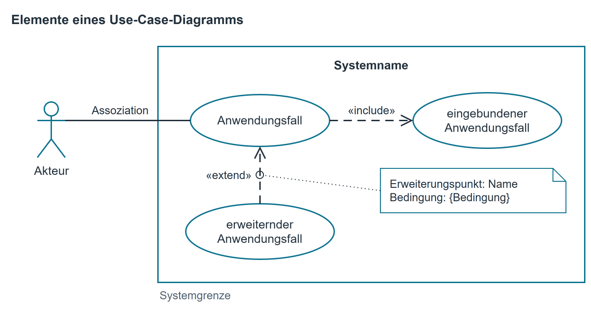
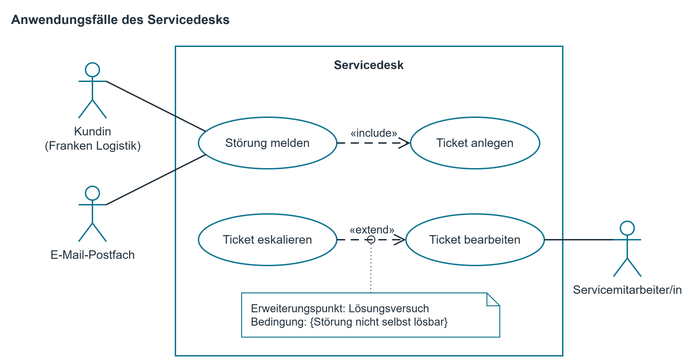
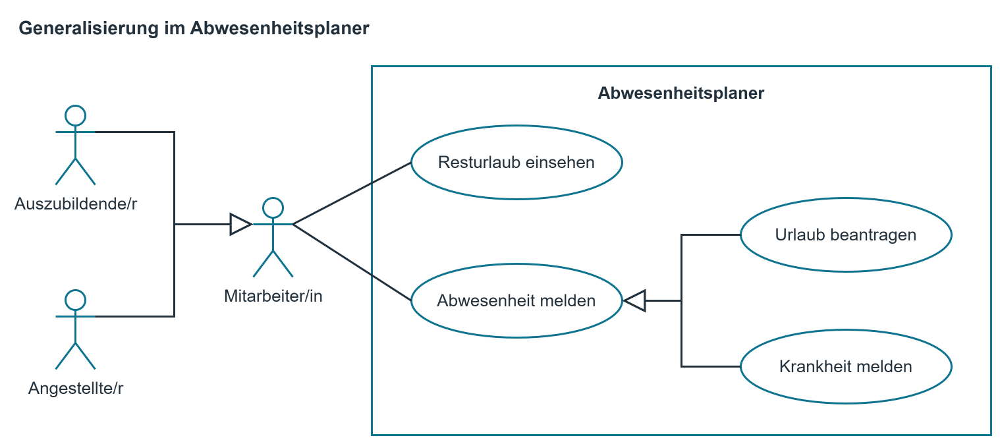

# Use-Case-Diagramm

*Anwendungsfalldiagramm*

## Was ein Use-Case-Diagramm ist

Ein Use-Case-Diagramm zeigt, wofür ein System benutzt wird und von wem. Es beantwortet drei
Fragen auf einem Blatt: Was gehört zum System und was nicht, wer hat mit ihm zu tun, und was kann
man mit ihm tun.

Es beschreibt ausdrücklich nicht, wie etwas abläuft oder in welcher Reihenfolge. Dafür sind
Aktivitätsdiagramm und Pseudocode zuständig. In der Methodenabteilung steht das Use-Case-Diagramm
meist am Anfang eines Auftrags, oft auf der ersten Seite eines Pflichtenhefts.

## Notation

{ .diagramm }

| Element | Bedeutung |
|--------------------------------------|-------------------------------------------------------------|
| Akteur (Strichfigur) | Eine Rolle außerhalb des Systems: ein Mensch oder ein anderes System. Nicht der Name einer Person, sondern die Rolle. |
| Anwendungsfall (Ellipse) | Etwas, das ein Akteur mit dem System tun kann, formuliert als Tätigkeit: „Ticket bearbeiten“. |
| Systemgrenze (Rechteck) | Alles darin gehört zum System und wird gebaut. Alles außerhalb nicht. |
| Assoziation (Linie) | Dieser Akteur ist an diesem Anwendungsfall beteiligt. |
| «include» (gestrichelter Pfeil) | Der Anwendungsfall am Pfeilanfang benutzt den am Pfeilende immer mit. |
| «extend» (gestrichelter Pfeil) | Der Anwendungsfall am Pfeilanfang erweitert den am Pfeilende in bestimmten Fällen. Jedes «extend» braucht einen Erweiterungspunkt. |
| Erweiterungspunkt (Extension Point), Notiz am «extend»-Pfeil | Die Stelle im erweiterten Anwendungsfall, an der die Erweiterung einsetzt, dazu die Bedingung. Beides steht in einer Notiz, die gepunktet am «extend»-Pfeil hängt: `Erweiterungspunkt: …` und `Bedingung: {…}`. |

Ältere Darstellungen schreiben die Erweiterungspunkte stattdessen unter einer Trennlinie in die
Ellipse des erweiterten Anwendungsfalls („extension points“). UML erlaubt das weiterhin, üblich ist
heute aber die Notiz am Pfeil. Begegnet Ihnen die Trennlinie in einer Aufgabe, ist sie also kein Fehler.

## Vorgehen

1. Systemgrenze zeichnen und benennen. Der Name ist der Name des Systems, nicht der des Projekts.
2. Akteure sammeln: Wer bedient es, wer bekommt Ergebnisse, welches Fremdsystem liefert Daten?
3. Anwendungsfälle sammeln: Was will jeder Akteur mit dem System erreichen? Jeder Anwendungsfall hat für den Akteur einen erkennbaren Nutzen.
4. Akteure und Anwendungsfälle verbinden. Ein Anwendungsfall ohne Akteur ist verdächtig.
5. Erst zum Schluss prüfen, ob Teile mehrfach vorkommen; solche Teile werden mit «include» herausgezogen.

## Beispiel aus dem Modellunternehmen

Der Servicedesk der Campus IT Solutions GmbH: Kundinnen und Kunden melden Störungen, teils
telefonisch, teils per E-Mail. Zu jeder Meldung entsteht ein Ticket, das ein Servicemitarbeiter
oder eine Servicemitarbeiterin bearbeitet. Lässt sich die Störung dabei nicht selbst lösen, wird
das Ticket eskaliert, also an eine Fachabteilung weitergegeben.

{ .diagramm }

Beachten Sie: „Störung melden“ zieht immer das Anlegen eines Tickets nach sich. Deshalb steht
dort «include». Das E-Mail-Postfach ist ein Akteur, obwohl es kein Mensch ist: Es steht außerhalb
der Systemgrenze und löst denselben Anwendungsfall aus wie die Kundin.

„Ticket eskalieren“ dagegen kommt nur unter einer Bedingung dazu: wenn die Störung beim Bearbeiten
nicht selbst gelöst werden kann. Deshalb steht dort «extend», und der Pfeil zeigt vom erweiternden
„Ticket eskalieren“ auf das erweiterte „Ticket bearbeiten“. Die Notiz am Pfeil nennt die Stelle in
„Ticket bearbeiten“, an der die Erweiterung einsetzt, und die Bedingung.

Wenn Sie ein bestehendes System beschreiben und für eine Verbindung keinen Beleg haben, zeichnen
Sie sie nicht einfach ein. Setzen Sie ein Fragezeichen daran. Eine Skizze, die Vermutung und
Beleg vermischt, ist als Grundlage für eine Ablösung wertlos.

## Kurzreferenz

| Prüfen Sie zum Schluss | Frage |
|--------------------|-------------------------------------------------------------|
| Systemgrenze | Steht jeder Akteur außerhalb und jeder Anwendungsfall innerhalb? |
| Rollen | Sind die Akteure Rollen und keine einzelnen Personen? |
| Nutzen | Hat jeder Anwendungsfall für seinen Akteur ein sichtbares Ergebnis? |
| Formulierung | Ist jeder Anwendungsfall eine Tätigkeit („… ausgeben“, „… erfassen“)? |
| Reihenfolge | Steht im Diagramm versehentlich ein Ablauf? Der gehört ins Aktivitätsdiagramm. |
| Fremdsysteme | Ist jedes beteiligte Fremdsystem als Akteur eingezeichnet? |
| Erweiterungspunkt | Hängt an jedem «extend» eine Notiz mit Erweiterungspunkt und Bedingung? |

Typische Fehler: zu kleine Anwendungsfälle („Button drücken“); Anwendungsfälle ohne Akteur;
Pfeile zwischen Anwendungsfällen, die eine Reihenfolge meinen.

## Erweiterung: Generalisierung

Neben «include» und «extend» kennt das Anwendungsfalldiagramm ein drittes Beziehungszeichen: die
**Generalisierung**, gezeichnet als durchgezogene Linie mit einer leeren Dreiecksspitze, die zum
allgemeineren Element zeigt. Sie kommt in zwei Formen vor.

| Form | Bedeutung | Beispiel |
|--------------------------|-------------------------------------------------|--------------------------------|
| Generalisierung von Akteuren | Zwei Rollen benutzen das System in derselben Weise. Die gemeinsame Rolle wird als allgemeiner Akteur gezeichnet und mit den Anwendungsfällen verbunden; die besonderen Rollen zeigen mit der Dreiecksspitze auf sie. | Auszubildende und Angestellte melden beide Abwesenheiten und sehen ihren Resturlaub ein; beide sind „Mitarbeiter/in“ |
| Generalisierung von Anwendungsfällen | Mehrere Anwendungsfälle sind Sonderfälle desselben Anwendungsfalls. | „Abwesenheit melden“ mit den Sonderfällen „Urlaub beantragen“ und „Krankheit melden“ |

Der Nutzen ist derselbe wie überall: **Was gleich ist, steht einmal.** Ohne die Generalisierung
müsste jede Verbindung doppelt gezogen werden, und beim nächsten Anwendungsfall vergisst jemand
eine der beiden.

Ein Beispiel aus dem Modellunternehmen: Im Abwesenheitsplaner der Campus IT Solutions GmbH melden
alle Mitarbeitenden, wann sie fehlen, und sehen nach, wie viel Urlaub ihnen noch zusteht.

{ .diagramm }

Auszubildende und Angestellte benutzen den Abwesenheitsplaner in derselben Weise. Deshalb hängen
beide Assoziationen am allgemeinen Akteur „Mitarbeiter/in“, und die beiden besonderen Akteure
zeigen mit der Dreiecksspitze auf ihn. „Urlaub beantragen“ und „Krankheit melden“ sind Sonderfälle
von „Abwesenheit melden“: In beiden Fällen wird ein Zeitraum gemeldet, in dem jemand fehlt, nur
der Urlaub muss zusätzlich genehmigt werden. Die Sonderfälle brauchen keine eigene Linie zum
Akteur, sie übernehmen die Assoziation des allgemeinen Anwendungsfalls.

Die drei Beziehungen sind leicht zu verwechseln. Diese Fragen trennen sie:

| Frage | Antwort |
|----------------------------------------------------------|--------------------------|
| Läuft der andere Anwendungsfall **jedes Mal** mit? | «include» |
| Kommt er **nur unter einer Bedingung** dazu? | «extend» (Erweiterungspunkt und Bedingung stehen in einer Notiz am Pfeil) |
| Ist das eine ein **Sonderfall** des anderen? | Generalisierung |

Die Pfeilrichtung ist Prüfungsstoff und wird oft verdreht: Bei «include» zeigt der Pfeil vom
aufrufenden auf den eingeschlossenen Anwendungsfall, bei «extend» vom erweiternden auf den
erweiterten — also **entgegengesetzt**. Bei der Generalisierung zeigt die Dreiecksspitze immer
auf das Allgemeinere.
