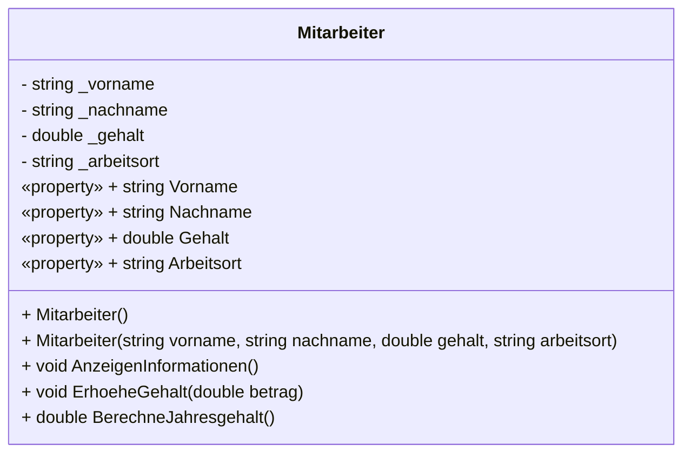

# Klasse Mitarbeiter

Dieses Kapitel verwendet die Beispielklasse `Mitarbeiter` mit privaten Attributen, die durch Properties zugänglich gemacht werden, sowie mit Konstruktoren und Methoden, um die Nutzung von Reflection zu demonstrieren.

