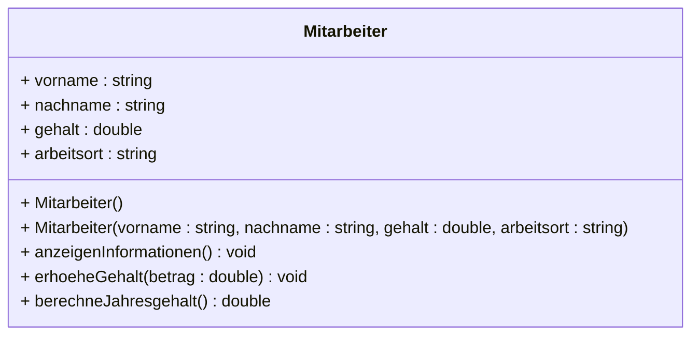

# Klasse Mitarbeiter

Dieses Kapitel verwendet die Beispielklasse `Mitarbeiter` mit privaten Attributen, die durch Properties zugänglich gemacht werden, sowie mit Konstruktoren und Methoden, um die Nutzung von Reflection zu demonstrieren.

```mermaid
classDiagram
    class Mitarbeiter {
        + vorname : string
        + nachname : string
        + gehalt : double
        + arbeitsort : string
        + Mitarbeiter()
        + Mitarbeiter(vorname : string, nachname : string, gehalt : double, arbeitsort : string)
        + anzeigenInformationen() void
        + erhoeheGehalt(betrag : double) void
        + berechneJahresgehalt() double
    }
```

Das Diagramm schreibt die Namen sprachneutral wie auf der Seite
[Klassendiagramm](../methoden/uml/klassendiagramm.md): Ein privates Feld mit seiner Property ist
**ein** Attribut, klein und ohne Unterstrich. Im C#-Code heißen die privaten Felder `_vorname`,
`_nachname`, `_gehalt` und `_arbeitsort`, die Properties `Vorname`, `Nachname`, `Gehalt` und
`Arbeitsort`, und die Methoden beginnen groß (`AnzeigenInformationen()`). Genau diese Namen
liefert Reflection: `GetFields()` die Felder, `GetProperties()` die Properties.
