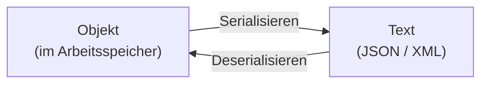
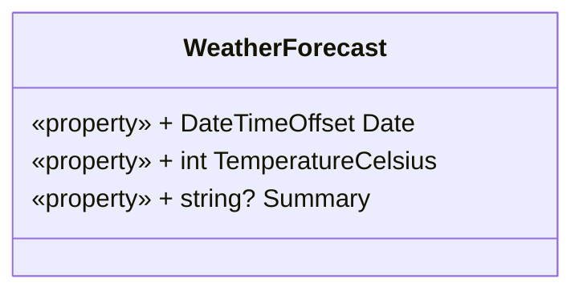

# Serialisierung & Deserialisierung

In nahezu jeder Anwendung müssen Daten gespeichert oder zwischen Programmen ausgetauscht werden. Ein Objekt lebt jedoch zunächst nur im Arbeitsspeicher und verschwindet, sobald das Programm beendet wird. Um Objekte dauerhaft zu speichern oder über das Netzwerk zu übertragen, müssen sie in ein **textbasiertes Format** umgewandelt werden. Genau das leisten Serialisierung und Deserialisierung.

## Begriffe

**Serialisierung**
:   Umwandlung eines Objekts (Zustand im Arbeitsspeicher) in eine textuelle Darstellung – z. B. einen JSON- oder XML-String. Diese kann in eine Datei geschrieben oder über das Netzwerk verschickt werden.

**Deserialisierung**
:   Der umgekehrte Weg: Aus einem JSON- oder XML-Text wird wieder ein vollwertiges Objekt im Arbeitsspeicher erzeugt.



## Wofür wird das gebraucht?

- **Konfigurationsdateien** lesen und schreiben (z. B. `appsettings.json`).
- **Datenaustausch** mit Web-APIs (REST-Schnittstellen verwenden meist JSON).
- **Speichern von Anwendungsdaten** wie Spielständen, Einstellungen oder Listen.
- **Kommunikation** zwischen unterschiedlichen Programmen oder Systemen.

## Zwei verbreitete Formate: JSON und XML

In diesem Kapitel werden zwei Formate behandelt. Für jedes Format gibt es in .NET eine eigene, spezialisierte Klassenbibliothek:

| Format | Bibliothek (Namespace) | Seite |
| ------ | ---------------------- | ----- |
| **JSON** | `System.Text.Json` | [JSON serialisieren & deserialisieren](json.md) |
| **XML**  | `System.Xml.Serialization` | [XML serialisieren & deserialisieren](xml.md) |

So sieht dasselbe Objekt in beiden Formaten aus:

**Als JSON:**

```json
{
  "Date": "2019-08-01T00:00:00+02:00",
  "TemperatureCelsius": 25,
  "Summary": "Hot"
}
```

**Als XML:**

```xml
<?xml version="1.0" encoding="utf-16"?>
<WeatherForecast>
  <Date>2019-08-01T00:00:00+02:00</Date>
  <TemperatureCelsius>25</TemperatureCelsius>
  <Summary>Hot</Summary>
</WeatherForecast>
```

## Durchgängiges Beispiel: `WeatherForecast`

Auf beiden Folgeseiten wird dieselbe einfache Beispielklasse verwendet. So lässt sich gut vergleichen, wie JSON und XML mit demselben Objekt umgehen.



```csharp
public class WeatherForecast
{
    public DateTimeOffset Date { get; set; }
    public int TemperatureCelsius { get; set; }
    public string? Summary { get; set; }
}
```

!!! info "Nur öffentliche Eigenschaften"
    Beide Bibliotheken arbeiten standardmäßig mit den **öffentlichen Properties** einer Klasse. Private Felder, Methoden und Logik werden **nicht** in den Text übernommen.

## Gegenüberstellung JSON vs. XML

| | `System.Text.Json` (JSON) | `System.Xml.Serialization` (XML) |
| --- | --- | --- |
| Namespace | `System.Text.Json` | `System.Xml.Serialization` |
| Serialisieren | `JsonSerializer.Serialize(obj)` | `serializer.Serialize(writer, obj)` |
| Deserialisieren | `JsonSerializer.Deserialize<T>(text)` (typisiert) | `(T)serializer.Deserialize(reader)` (Cast nötig) |
| Felder (fields) | werden ignoriert | öffentliche werden serialisiert |
| Parameterloser Konstruktor | nicht zwingend | **Pflicht** |
| Abgleich der Namen | beachtet Groß-/Kleinschreibung | nach Element-/Attributnamen |
| Lesbarkeit | kompakt, weit verbreitet bei Web-APIs | ausführlicher, mit Attributen/Namespaces |

!!! tip "Empfehlung"
    Für neue Projekte und den Austausch mit Web-APIs ist **JSON** heute der Standard. **XML** begegnet einem vor allem bei bestehenden Systemen, Konfigurationsdateien (z. B. `.csproj`) und im Datenaustausch mit älteren Schnittstellen.
