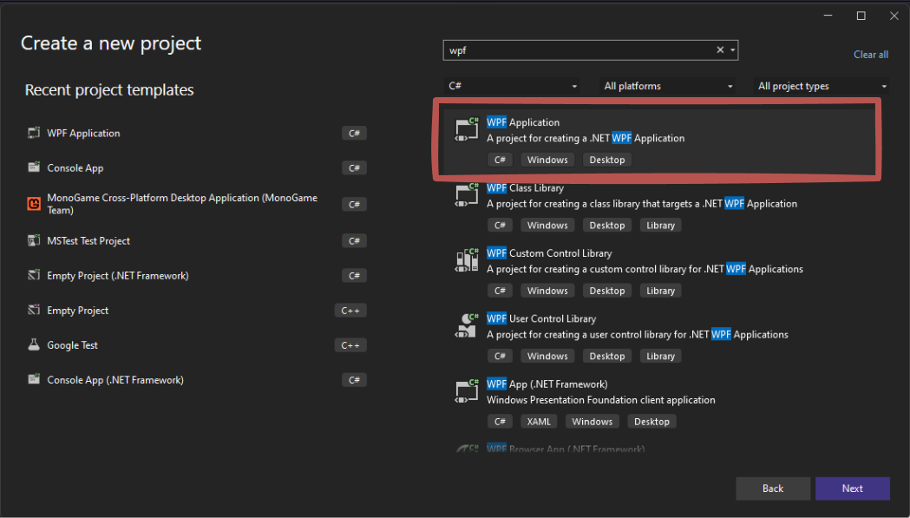

# Erstellung eines WPF-Projekts

Zum erstellen eines WPF-Projekts gehen wir wie gewohnt vor. Einziger Unterschied ist, dass wir bei der Auswahl des Templates "WPF Application" auswählen.



Achten Sie im nächsten Schritt auf das **Framework**: In unseren Projekten ist das **.NET 8**.
Fehlt die Vorlage *WPF-Anwendung* in der Liste, ist im Visual Studio Installer die Arbeitslast
**.NET-Desktopentwicklung** nicht installiert.

## Die ersten Handgriffe im neuen Projekt

Ein frisches WPF-Projekt enthält vier Dateien, die Sie kennen sollten:

| Datei | Wozu |
| --- | --- |
| `App.xaml` | Startverhalten. `StartupUri` legt fest, welches Fenster beim Start geöffnet wird. |
| `App.xaml.cs` | Zunächst leer. Hier stünde eigene Startlogik. |
| `MainWindow.xaml` | Aufbau des Hauptfensters. Hier arbeiten Sie zuerst. |
| `MainWindow.xaml.cs` | Der Code dazu (Code-Behind). |

Was zu Beginn üblicherweise angepasst wird:

``` xml
<Window x:Class="Fuhrpark.MainWindow"
        ...
        Title="Fuhrpark" Height="480" Width="760"
        MinHeight="400" MinWidth="640">
```

- `Title` ist die Beschriftung in der Titelleiste — der Vorgabewert „MainWindow" bleibt sonst bis
  zur Abgabe stehen.
- `Height` und `Width` sind die Startgröße, `MinHeight` und `MinWidth` verhindern, dass sich das
  Fenster kleiner ziehen lässt, als der Inhalt braucht.
- Der Rest der Zeilen (`xmlns:…`, `mc:Ignorable`) wird nicht angefasst.

Danach wird als Erstes das `Grid` in Zeilen und Spalten aufgeteilt — siehe
[Steuerelemente und Layout](elemente.md). Wer zuerst Elemente hineinzieht und danach das Layout
baut, räumt zweimal auf.

!!! info "Starten und beenden"
	Gestartet wird mit **F5**. Beendet wird die laufende Anwendung über ihr eigenes Fenster
	oder in Visual Studio über *Debuggen → Debuggen beenden* (Umschalt+F5) — das hilft auch,
	wenn sich ein Fenster wegen eines Fehlers nicht mehr schließen lässt.

## Eine Oberfläche zu einem vorhandenen Projekt hinzufügen

Häufig gibt es schon ein Konsolenprojekt mit den Klassen für Daten, Logik und Ablage, und die Oberfläche kommt später dazu. Dann wird **kein neues Projekt von Grund auf** angelegt und **nichts kopiert**, sondern ein zweites Projekt in dieselbe Projektmappe gestellt, das auf das vorhandene verweist.

**1. WPF-Projekt hinzufügen**

Rechtsklick auf die **Projektmappe** → *Hinzufügen* → *Neues Projekt* → *WPF-Anwendung*. Die Projektmappe enthält danach zwei Projekte.

**2. Verweis auf das vorhandene Projekt setzen**

Rechtsklick auf das **neue WPF-Projekt** → *Hinzufügen* → *Projektverweis* → das vorhandene Projekt ankreuzen.

Im Projektdatei-Eintrag sieht das so aus:

```xml
<ItemGroup>
  <ProjectReference Include="..\MeinProjekt\MeinProjekt.csproj" />
</ItemGroup>
```

**3. Startprojekt festlegen**

Rechtsklick auf das WPF-Projekt → *Als Startprojekt festlegen*. Sonst startet weiterhin das Konsolenprojekt. Über *Starten* im Kontextmenü lässt sich jederzeit auch das andere Projekt ausführen.

**4. Die Klassen verwenden**

Liegen beide Projekte im selben Namensraum-Zweig (z. B. `MeinProjekt` und `MeinProjekt.Oberflaeche`), können Sie die Klassen direkt verwenden. Sonst gehört ein `using MeinProjekt;` an den Anfang der Datei.

!!! info "Warum ein Verweis und keine Kopie"
    Werden die Klassen kopiert, gibt es sie zweimal. Eine Fehlerbehebung an der einen Stelle fehlt dann an der anderen, und nach ein paar Wochen weiß niemand mehr, welche Fassung gilt. Der Verweis sorgt dafür, dass es die Klassen genau einmal gibt — und er ist zugleich der Nachweis, dass die Oberfläche wirklich ohne Änderung auf dem Vorhandenen aufsetzt.

!!! warning "Der Verweis zeigt in eine Richtung"
    Die Oberfläche verweist auf das Projekt mit der Logik, nie umgekehrt. Wer beide aufeinander verweisen lässt, bekommt beim Übersetzen einen Zirkelverweis.
