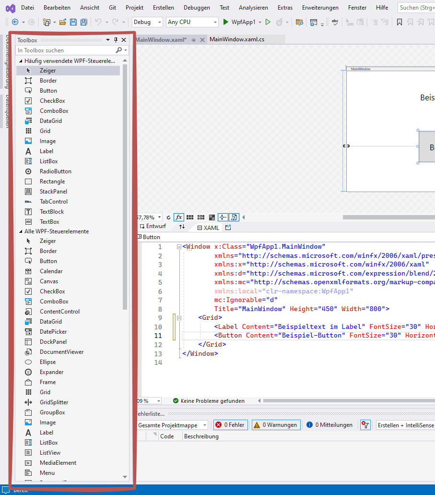

# Steuerelemente und Layout

In WPF können verschiedene Steuerelemente und Layout-Container verwendet werden, um die Benutzeroberfläche einer Anwendung zu erstellen. In Visual Studio können Sie diese Elemente einfach aus der Toolbox in das Fenster ziehen. Diese Elemente erscheinen dann sowohl in der visuellen Oberfläche als auch im XAML-Code.

## Verwendung der Toolbox

Die Toolbox in Visual Studio enthält eine Vielzahl von Steuerelementen, die Sie in Ihre WPF-Anwendung einfügen können. Zu den häufig verwendeten Steuerelementen gehören Labels, Buttons, TextBoxen und viele mehr. Um ein Steuerelement hinzuzufügen, ziehen Sie es einfach aus der Toolbox in das Fenster im Designer.

{ width="400" }

## Beispiel

Der folgende XAML-Code zeigt ein einfaches Beispiel, bei dem ein `Label` und ein `Button` in einem `Grid`-Layout-Container verwendet werden. Diese Elemente wurden aus der Toolbox in das Fenster gezogen.

```xml
<Window x:Class="WpfApp1.MainWindow"
        xmlns="http://schemas.microsoft.com/winfx/2006/xaml/presentation"
        xmlns:x="http://schemas.microsoft.com/winfx/2006/xaml"
        xmlns:d="http://schemas.microsoft.com/expression/blend/2008"
        xmlns:mc="http://schemas.openxmlformats.org/markup-compatibility/2006"
        xmlns:local="clr-namespace:WpfApp1"
        mc:Ignorable="d"
        Title="MainWindow" Height="450" Width="800">
    <Grid>
        <Label Content="Beispieltext im Label" FontSize="30" HorizontalAlignment="Center" Margin="0,67,0,0" VerticalAlignment="Top"/>
        <Button Content="Beispiel-Button" FontSize="30" HorizontalAlignment="Center" Margin="0,217,0,0" VerticalAlignment="Top" Height="110" Width="278" Click="Button_Click"/>
    </Grid>
</Window>
```

## Erklärung des Codes

- **Window**: Das grundlegende Container-Element für die Benutzeroberfläche der Anwendung. Es definiert das Hauptfenster.
- **Grid**: Ein Layout-Container, der eine flexible Anordnung der UI-Elemente ermöglicht. Elemente können in Zeilen und Spalten angeordnet werden.
- **Label**: Ein einfaches Steuerelement zur Anzeige von Text.
    - `Content`: Der anzuzeigende Text.
    - `FontSize`: Die Schriftgröße des Textes.
    - `HorizontalAlignment` und `VerticalAlignment`: Die Ausrichtung des Labels innerhalb des Grid.
    - `Margin`: Der Abstand um das Label.
- **Button**: Ein Steuerelement, das eine Aktion auslöst, wenn es angeklickt wird.
    - `Content`: Der Text, der auf dem Button angezeigt wird.
    - `FontSize`: Die Schriftgröße des Textes.
    - `HorizontalAlignment` und `VerticalAlignment`: Die Ausrichtung des Buttons innerhalb des Grid.
    - `Height` und `Width`: Die Höhe und Breite des Buttons.
    - `Click`: Der Name der Methode im Code-Behind, die beim Anklicken aufgerufen wird.

## Warum `Margin` allein nicht reicht

Zieht man Elemente aus der Toolbox in den Designer, schreibt Visual Studio für jedes ein
`Margin="65,79,0,0"` — den Abstand zur oberen linken Ecke. Das sieht im Designer richtig aus und
geht kaputt, sobald jemand das Fenster größer zieht: Die Elemente bleiben stehen, wo sie sind,
und der neue Platz bleibt leer.

Ein Fenster wird deshalb nicht über Abstände aufgebaut, sondern über **Zeilen und Spalten**.
`Margin` bleibt danach nur für den Feinabstand zwischen zwei Elementen.

## Das Grid: Zeilen und Spalten

Das `Grid` ist der Standard-Container in WPF. Zuerst werden die Zeilen und Spalten festgelegt,
dann sagt jedes Element, wo es hingehört.

``` xml
<Grid Margin="12">

    <Grid.ColumnDefinitions>
        <ColumnDefinition Width="Auto"/>   <!-- (1) -->
        <ColumnDefinition Width="*"/>      <!-- (2) -->
        <ColumnDefinition Width="200"/>    <!-- (3) -->
    </Grid.ColumnDefinitions>

    <Grid.RowDefinitions>
        <RowDefinition Height="Auto"/>
        <RowDefinition Height="Auto"/>
        <RowDefinition Height="*"/>
        <RowDefinition Height="Auto"/>
    </Grid.RowDefinitions>

    <Label   Grid.Row="0" Grid.Column="0" Content="Kennzeichen"/>
    <TextBox Grid.Row="0" Grid.Column="1" x:Name="tbKennzeichen"/>

    <Label   Grid.Row="1" Grid.Column="0" Content="Standort"/>
    <TextBox Grid.Row="1" Grid.Column="1" x:Name="tbStandort"/>

    <ListBox Grid.Row="0" Grid.Column="2" Grid.RowSpan="3" x:Name="lbFahrzeuge"/>  <!-- (4) -->

    <Button  Grid.Row="3" Grid.Column="1" x:Name="btSpeichern" Content="Speichern"
             HorizontalAlignment="Right" Width="120"/>
</Grid>
```

1. `Auto` — so breit, wie der Inhalt es braucht. Für Beschriftungen.
2. `*` — nimmt den restlichen Platz und wächst mit dem Fenster. Davon gibt es meist genau eine
   Spalte und eine Zeile.
3. Eine feste Zahl sind geräteunabhängige Pixel.
4. `Grid.RowSpan="3"` zieht das Element über drei Zeilen. `Grid.ColumnSpan` gibt es genauso.

| Angabe | Bedeutung |
| --- | --- |
| `Grid.Row`, `Grid.Column` | In welcher Zelle das Element sitzt. Wird nichts angegeben, gilt Zeile 0, Spalte 0 — dann liegen Elemente übereinander. |
| `Grid.RowSpan`, `Grid.ColumnSpan` | Über wie viele Zellen sich das Element erstreckt. |
| `HorizontalAlignment`, `VerticalAlignment` | Wo das Element **innerhalb** seiner Zelle sitzt. Ohne Angabe füllt es die Zelle aus. |
| `Margin` | Feinabstand zum Zellenrand, z. B. `Margin="0,0,8,4"` (links, oben, rechts, unten). |

!!! info "Die Reihenfolge im XAML bestimmt nicht die Anordnung"
	Wo ein Element steht, sagt allein `Grid.Row`/`Grid.Column`. Das erste Element im XAML kann
	unten rechts landen. Der Reihenfolge im Quelltext folgt nur eines: **in welcher Reihenfolge
	die Elemente beim Öffnen des Fensters entstehen** (siehe [Ereignisse](ereignisse.md)).

!!! warning "Zwei Elemente in derselben Zelle"
	Sie liegen übereinander, das später notierte oben. Meist ist es ein vergessenes
	`Grid.Row`. Ein `Grid` mit nur einer Zeile und einer Spalte verhält sich genau so wie gar
	kein Layout.

## Mehrere Elemente in einer Zelle: `StackPanel`

Drei Auswahlknöpfe nebeneinander brauchen keine drei Spalten. Ein `StackPanel` reiht seine Kinder
auf — waagerecht oder senkrecht — und sitzt selbst in einer Zelle des `Grid`.

``` xml
<StackPanel Grid.Row="2" Grid.Column="1" Orientation="Horizontal">
    <RadioButton x:Name="rbDiesel"  GroupName="Antrieb" Content="Diesel"  Margin="0,0,16,0"/>
    <RadioButton x:Name="rbBenzin"  GroupName="Antrieb" Content="Benzin"  Margin="0,0,16,0"/>
    <RadioButton x:Name="rbElektro" GroupName="Antrieb" Content="Elektro"/>
</StackPanel>
```

`Orientation="Vertical"` stapelt untereinander. Für ganze Fenster ist das `Grid` besser: Ein
`StackPanel` kennt keine Spalten, also stehen Beschriftungen und Felder nicht untereinander
bündig.

## Die wichtigsten Steuerelemente

| Element | Wofür | Wichtige Eigenschaften |
| --- | --- | --- |
| `Label` | Kurze Beschriftung, auch als Anzeigefläche verwendbar | `Content` |
| `TextBlock` | Reiner Anzeigetext, mehrzeilig | `Text`, `TextWrapping` |
| `TextBox` | Eingabefeld | `Text`, `IsReadOnly` |
| `Button` | Löst eine Aktion aus | `Content`, `IsEnabled`, `IsDefault` |
| `ListBox` | Liste zum Auswählen | `Items`, `SelectedItem`, `SelectedIndex` |
| `ComboBox` | Aufklappliste, spart Platz | `Items`, `SelectedIndex` |
| `Slider` | Zahl zwischen zwei Grenzen einstellen | `Minimum`, `Maximum`, `Value` |
| `RadioButton` | Genau eine Möglichkeit aus mehreren | `IsChecked`, **`GroupName`** |
| `CheckBox` | Ein Haken, unabhängig von anderen | `IsChecked` (ein `bool?`) |
| `GroupBox` | Fasst zusammengehörige Elemente sichtbar zusammen | `Header` |

!!! warning "`GroupName` bei `RadioButton` nicht vergessen"
	Ohne `GroupName` gehören **alle** Auswahlknöpfe im selben Container zu einer einzigen Gruppe
	— dann lässt sich Antrieb und Farbe nicht mehr unabhängig wählen. Elemente mit gleichem
	`GroupName` bilden je eine Gruppe, in der immer genau einer gewählt ist.

!!! info "`IsChecked` ist ein `bool?`"
	Bei `CheckBox` und `RadioButton` gibt es drei Zustände, deshalb wird auf `== true` geprüft:

	``` csharp
	if (chAktiv.IsChecked == true)
	{
	    // Haken ist gesetzt
	}
	```

### Ein Element aus- und einblenden

``` csharp
gbFilter.Visibility = Visibility.Collapsed;   // weg, und der Platz wird frei
gbFilter.Visibility = Visibility.Hidden;      // unsichtbar, der Platz bleibt leer stehen
gbFilter.Visibility = Visibility.Visible;     // wieder da
```

!!! info "Ausblenden oder sperren?"
	Etwas, das gerade nicht geht, wird **gesperrt** (`IsEnabled = false`) — dann sieht die
	Anwenderin, dass es die Möglichkeit gibt. **Ausgeblendet** wird nur, was sie selbst
	weggeschaltet hat, etwa ein Bereich mit selten gebrauchten Einstellungen.

## Benennung von Steuerelementen

Ein `x:Name` wird gebraucht, sobald das Element im Code angesprochen wird. In unseren Projekten
beginnt er mit einem kurzen Kürzel für die Art des Elements, danach folgt in Großschreibung, was
das Element enthält.

| Element | Kürzel | Beispiel |
| --- | --- | --- |
| `Button` | `bt` | `btSpeichern` |
| `TextBox` | `tb` | `tbKennzeichen` |
| `TextBlock` | `tx` | `txHinweis` |
| `Label` | `la` | `laUeberschrift` |
| `ListBox`, `ListView` | `lb` | `lbFahrzeuge` |
| `ComboBox` | `cb` | `cbStandort` |
| `CheckBox` | `ch` | `chAktiv` |
| `RadioButton` | `rb` | `rbDiesel` |
| `Slider` | `sl` | `slBreite` |
| `GroupBox` | `gb` | `gbFilter` |
| `StackPanel`, `Grid` (nur wenn benötigt) | `sp`, `gr` | `spSchaltflaechen` |

!!! warning "`cb` ist die ComboBox, `ch` die CheckBox"
	Beide fangen mit c an. Wer sich hier verschreibt, sucht den Fehler lange — der Übersetzer
	meldet nur, dass es den Namen nicht gibt.

Beschriftungs-Labels, die sich nie ändern, bekommen **keinen** Namen. Ein Fenster mit dreißig
Namen, von denen zwanzig nirgends vorkommen, liest sich schlechter als eines mit zehn.

## Auf einen Klick reagieren

Ein Steuerelement allein tut noch nichts. Damit beim Anklicken etwas geschieht, braucht der Button einen
**Click-Handler**: eine Methode in der zugehörigen `.xaml.cs`-Datei.

Am schnellsten geht es mit einem Doppelklick auf den Button im Designer — Visual Studio trägt dann das
Attribut `Click` im XAML ein und legt die Methode an. Von Hand sieht das so aus:

```xml
<Button x:Name="btBeispiel" Content="Beispiel-Button" Click="btBeispiel_Click"/>
```

```csharp
private void btBeispiel_Click(object sender, RoutedEventArgs e)
{
    MessageBox.Show("Der Button wurde angeklickt.");
}
```

!!! warning "Name im XAML und Name der Methode müssen zusammenpassen"
    Wird die Methode im Code umbenannt, ohne das Attribut `Click` anzupassen, meldet der Übersetzer
    *„The name 'xyz' does not exist in the current context"* — und zwar in der erzeugten Datei, nicht
    in Ihrer. Benennen Sie deshalb an beiden Stellen um.

!!! info "`x:Name` brauchen Sie, wenn Sie das Element im Code ansprechen wollen"
    Nur Steuerelemente mit `x:Name` lassen sich aus dem Code-Behind heraus verändern
    (`btBeispiel.IsEnabled = false;`). Ein reines Beschriftungs-Label braucht keinen Namen.

!!! info
    Durch das Ziehen von Steuerelementen aus der Toolbox in das Fenster im Designer werden diese Elemente automatisch im XAML-Code der entsprechenden Datei eingefügt. Dies ermöglicht eine visuelle Bearbeitung der Benutzeroberfläche und eine einfache Anpassung des Layouts und der Steuerelemente.

## Weiter geht es bei den Ereignissen

`Click` ist nur eines von vielen Ereignissen. Welche Ereignisse die übrigen Steuerelemente
melden, wie man das Schließen eines Fensters abfängt und warum eine Ereignismethode manchmal
schon läuft, bevor das Fenster fertig ist, steht unter [Ereignisse](ereignisse.md).
