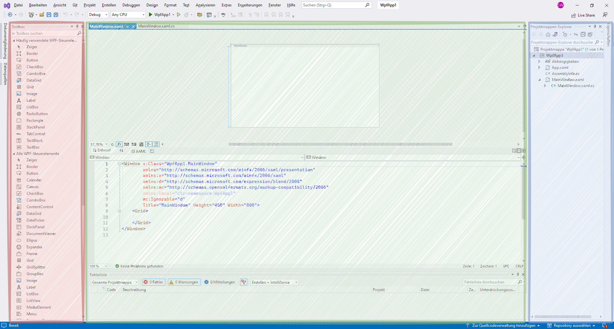

# Grundlagen von WPF

## Aufbau einer WPF-Anwendung

### Projektstruktur

Eine typische WPF-Anwendung besteht aus mehreren Dateien und Ordnern, die zusammenarbeiten, um die Benutzeroberfläche und die Geschäftslogik zu definieren. 

Die wichtigsten Bestandteile einer WPF-Anwendung sind:

- **App.xaml und App.xaml.cs**: Diese Dateien definieren die Anwendungsressourcen und das Startverhalten der Anwendung. `App.xaml` enthält allgemeine Ressourcen wie Stile und Vorlagen; das Attribut `StartupUri` legt fest, welches Fenster beim Start geöffnet wird. `App.xaml.cs` ist zunächst leer und nimmt eigene Initialisierungslogik auf.

!!! info "Wo ist die Main-Methode?"
	In einem WPF-Projekt schreiben Sie keine `Main`-Methode. Sie wird beim Übersetzen aus `App.xaml` erzeugt und ruft die Anwendung mit dem Fenster auf, das in `StartupUri` steht. Deshalb finden Sie sie im Projektmappen-Explorer nicht.
  
  ```xml
  <!-- App.xaml -->
  <Application x:Class="WpfApp1.App"
               xmlns="http://schemas.microsoft.com/winfx/2006/xaml/presentation"
               xmlns:x="http://schemas.microsoft.com/winfx/2006/xaml"
               StartupUri="MainWindow.xaml">
      <Application.Resources>
          <!-- Ressourcen wie Stile, Vorlagen, etc. -->
      </Application.Resources>
  </Application>
  ```

  ```csharp
  // App.xaml.cs
  using System.Windows;

  namespace WpfApp1
  {
      public partial class App : Application
      {
      }
  }
  ```

- **MainWindow.xaml und MainWindow.xaml.cs**: Diese Dateien definieren das Hauptfenster der Anwendung. `MainWindow.xaml` beschreibt das Layout und die Benutzeroberfläche, während `MainWindow.xaml.cs` die Interaktionslogik für das Hauptfenster enthält.

  ```xml
  <!-- MainWindow.xaml -->
  <Window x:Class="WpfApp1.MainWindow"
          xmlns="http://schemas.microsoft.com/winfx/2006/xaml/presentation"
          xmlns:x="http://schemas.microsoft.com/winfx/2006/xaml"
          xmlns:d="http://schemas.microsoft.com/expression/blend/2008"
          xmlns:mc="http://schemas.openxmlformats.org/markup-compatibility/2006"
          mc:Ignorable="d"
          Title="MainWindow" Height="450" Width="800">
      <Grid>
          <!-- Benutzeroberflächen-Elemente -->
      </Grid>
  </Window>
  ```

  ```csharp
  // MainWindow.xaml.cs
  using System.Windows;

  namespace WpfApp1
  {
      public partial class MainWindow : Window
      {
          public MainWindow()
          {
              InitializeComponent();
          }
      }
  }
  
  ```

### Hauptkomponenten

Eine WPF-Anwendung besteht aus mehreren Hauptkomponenten, die zusammenarbeiten, um eine reiche Benutzererfahrung zu bieten:

- **Fenster (Window)**: Das grundlegende Container-Element für die Benutzeroberfläche einer WPF-Anwendung. Fenster können mehrere UI-Elemente enthalten und unterstützen Funktionen wie Größenänderung, Minimierung und Maximierung.

- **Steuerelemente (Controls)**: UI-Elemente wie Buttons, TextBoxen, Labels, ListBoxen, etc., die in einem Fenster platziert werden können, um die Interaktion mit dem Benutzer zu ermöglichen. In der Toolbox auf der linken Seite des Visual Studio Fensters sehen Sie eine Auswahl der häufig verwendeten WPF-Steuerelemente.

- **Layouts**: Container-Elemente wie Grid, StackPanel, DockPanel, etc., die verwendet werden, um andere UI-Elemente in einer bestimmten Anordnung zu platzieren. Im `MainWindow.xaml` wird ein `Grid`-Layout verwendet, um die Benutzeroberfläche zu strukturieren.

### Beispielstruktur

Das Bild zeigt die typische Struktur einer WPF-Anwendung in Visual Studio:

<figure markdown="span">
  { width="800" }
  <figcaption>Leeres Beispielprojekt</figcaption>
</figure>

- <span style="color: #B85450">**Toolbox**: </span>Enthält eine Liste der verfügbaren Steuerelemente, die in die Benutzeroberfläche gezogen und dort verwendet werden können. Wird diese nicht angezeigt, kann Sie entweder unter dem Menüpunkt "Ansicht" oder via Tastenkombination `Strg + W, X` eingeblendet werden.
- <span style="color: #82B366">**XAML-Editor und Designer**: </span>Der obere Bereich zeigt den visuellen Designer, in dem Sie die Benutzeroberfläche visuell bearbeiten können. Der untere Bereich zeigt den XAML-Code, in dem Sie die Benutzeroberfläche in XAML definieren können.
- <span style="color: #6C8EBF">**Projektmappen-Explorer**: </span>Zeigt die Dateien und Ordner des Projekts. Hier sehen Sie die `App.xaml`, `MainWindow.xaml`, und deren zugehörige Code-Behind-Dateien.

!!! info
    Die Projektstruktur und die Hauptkomponenten einer WPF-Anwendung sind entscheidend für die Organisation und Verwaltung des Codes. Eine klare Trennung von Layout (XAML) und Logik (C#) fördert die Wartbarkeit und Erweiterbarkeit der Anwendung.

## Was `InitializeComponent()` macht

In jedem Fenster steht diese eine Zeile im Konstruktor, und sie steht dort immer als Erste:

```csharp
public MainWindow()
{
    InitializeComponent();
}
```

Die Methode schreiben Sie nicht selbst — sie wird beim Übersetzen aus der `.xaml`-Datei erzeugt.
Sie tut vier Dinge:

1. Sie liest die XAML-Beschreibung des Fensters.
2. Sie erzeugt daraus die Steuerelemente und setzt ihre Eigenschaften.
3. Sie füllt für jedes Element mit `x:Name` das gleichnamige Feld, über das Sie es später im Code
   ansprechen.
4. Sie hängt die Ereignismethoden an die Elemente, deren Namen in Attributen wie
   `Click="..."` stehen.

!!! warning "Vor dieser Zeile gibt es kein einziges Steuerelement"
	Wer im Konstruktor **vor** `InitializeComponent()` auf ein Element zugreift, bekommt eine
	`NullReferenceException`. Alles, was das Fenster füllt oder einstellt, gehört danach — am
	besten in das Ereignis `Loaded` des Fensters.

	Dass ein Ereignis sogar **während** dieser Zeile laufen kann, steht unter
	[Ereignisse](ereignisse.md).

## XAML und Code-Behind: was wohin gehört

| Datei | Inhalt | Frage, die sie beantwortet |
| --- | --- | --- |
| `MainWindow.xaml` | Aufbau des Fensters: welche Elemente, wo, wie beschriftet, welche Methode bei welchem Ereignis | *Wie sieht es aus?* |
| `MainWindow.xaml.cs` | Die Ereignismethoden und die Hilfsmethoden des Fensters | *Was passiert?* |

Beide Dateien beschreiben **dieselbe Klasse** — deshalb steht `partial` davor. Im XAML sagt
`x:Class="WpfApp1.MainWindow"`, zu welcher Klasse die Beschreibung gehört. Stimmen Namensraum
oder Klassenname nicht überein, lässt sich das Projekt nicht übersetzen.

!!! info "Warum die Trennung?"
	Das Aussehen lässt sich ändern, ohne das Verhalten anzufassen — und umgekehrt. Wie weit sich
	diese Trennung treiben lässt, zeigt später die [Datenbindung](databinding.md) mit MVVM.
